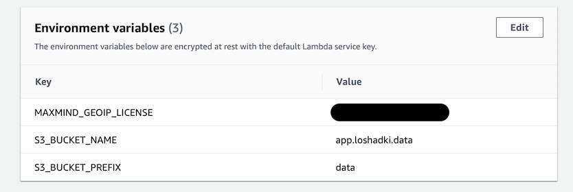
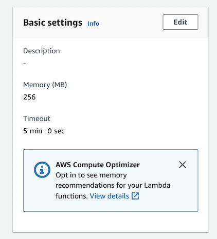
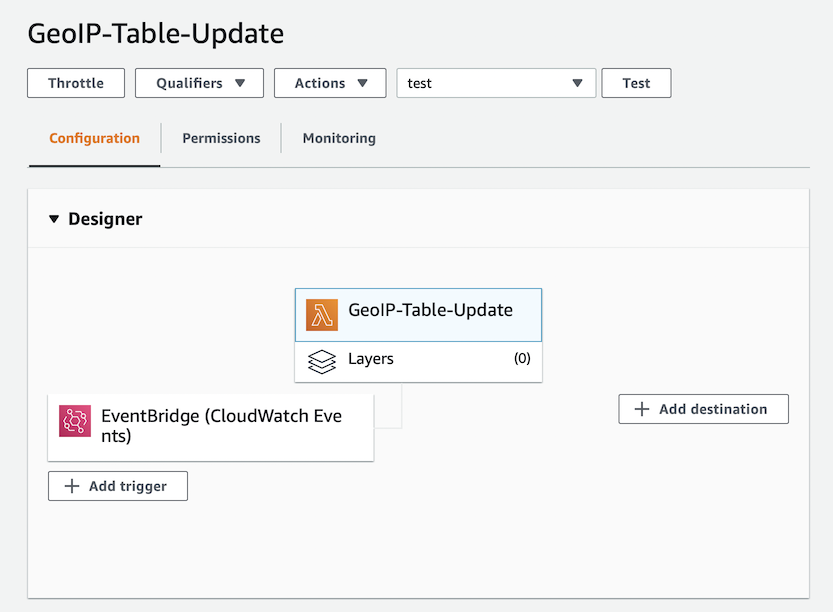
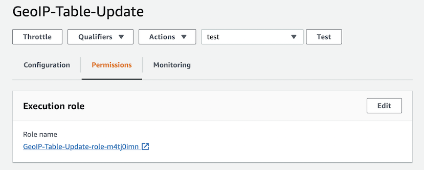
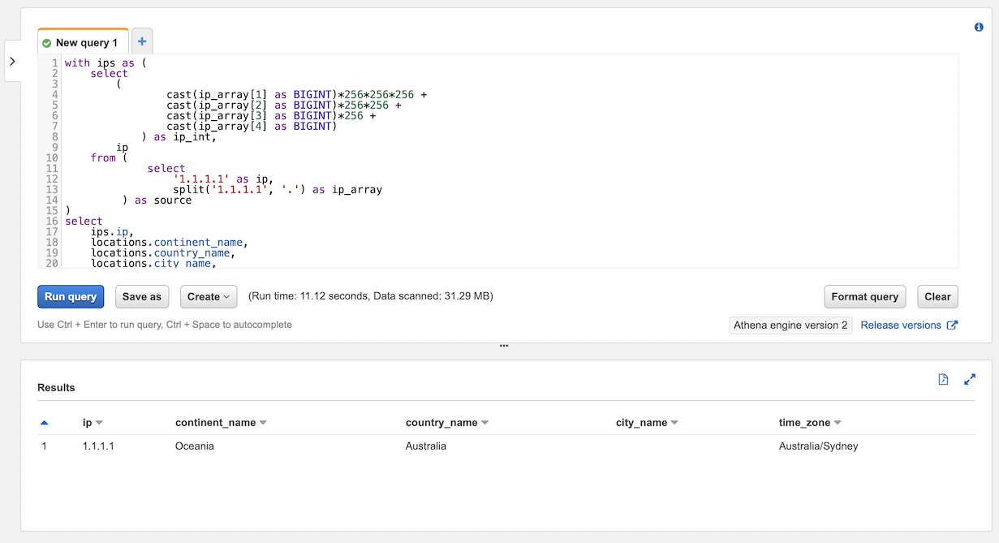

Suppose you want to analyze web traffic properly. A lot of time, you want to know the GEO origin of the requests. 
It is possible to map IP addresses to Locations. You can use MaxMind GeoIP tables. MaxMind provides a free version 
of their Lite tables that they update weekly.

In this post, we create a Lambda function, which we run on schedule every 7 days (weekly). This function uploads 
the latest tables (CSV files) to S3 from MaxMind. We use these CSV files as sources for AWS Athena tables to use 
them in SQL to implement GEO IP Lookups.

## Sign Up for a MaxMind account

To be able to use [GeoLite2 databases](https://dev.maxmind.com/geoip/geoip2/geolite2/), you need to sign up for a 
[MaxMind account](https://www.maxmind.com). After you signed up, under *Services* you can find "My Service Key", 
generate a new one (I have generated it in a new format at the time of posting this). Save this Service Key.
We use GeoLite2-City-CSV format, that we can use as a source for AWS Athena tables. You can read more about this
format at [GeoIP2 City and Country CSV Databases](https://dev.maxmind.com/geoip/geoip2/geoip2-city-country-csv-databases/).

Test the newly generated license key and looks at the CSV files by using this `curl` command

```bash
curl -o GeoLite2-City-CSV.zip \
  'https://download.maxmind.com/app/geoip_download?edition_id=GeoLite2-City-CSV&license_key={{YOUR_LICENSE_KEY}}&suffix=zip'
```

> Check the latest documentation on how to [download GeoIP database](https://dev.maxmind.com/geoip/geoip-direct-downloads/)

## Lambda function to upload GeoIP tables to S3

I have created a bucket `s3://app.loshadki.data`, and I am planning to store my databases under

- `s3://app.loshadki.datadata/geoip_blocks/data.csv.gz` - CSV file containing data on IPv4 addresses 
- `s3://app.loshadki.datadata/geoip_locations/data.csv.gz` - CSV file containing data location

Create a new Lambda Function. I call it `GeoIP-Table-Update` and using `python:3.8`. 

Add environment variables:

- `MAXMIND_GEOIP_LICENSE` - your license key from MaxMind
- `S3_BUCKET_NAME` - S3 bucket name, I use `app.loshadki.data`
- `S3_BUCKET_PREFIX` - prefix for databases, I use `data`



This function will be long-running. Change in basic settings Timeout to 5 minutes. I have changed the memory
to `256Mb`. With more memory, you also get more CPU power, so it is cheaper to run it under more memory, 
even if you are not using it. We run this function only once a week, so change to your bill is minimum.



To run it every week add a new trigger, select *EventBridge (Cloud Watch Events)*, create a new 
rule `upload-geoip-to-s3-weekly` with schedule expression `rate(7 days)`.



To be able to write to your S3 bucket go to Permissions tab, open autogenerated Role, and add inline Permission

```json
{
  "Version": "2012-10-17",
  "Statement": [
    {
      "Effect": "Allow",
      "Action": "s3:PutObject",
      "Resource": "arn:aws:s3:::app.loshadki.data/data/*"
    }
  ]
}
```



Now copy-paste the code from below, deploy and test it. It will take a few minutes to run. On success, you should see the
files uploaded to your S3 location.

### Code of Lambda Function

```python
import os
import os.path
import urllib.request
import shutil
import zipfile
import tempfile
import gzip
import boto3

def lambda_handler(event, context):
    with tempfile.TemporaryDirectory() as tmpdirname:
        zipfilename = os.path.join(tmpdirname, 'GeoLite2-City-CSV.zip')

        print('step 1 - download geolite ip database')
        download_geo_ip(tmpdirname, zipfilename)
        print('step 2 - unzip all files')
        unzip_all(tmpdirname, zipfilename)
        print('step 3 - gzip files')
        gzip_files(tmpdirname)
        print('step 4 - upload to s3')
        upload_to_s3(tmpdirname)

    return

def download_geo_ip(tmpdirname, zipfilename):
    geoip_url = 'https://download.maxmind.com/app/geoip_download?edition_id=GeoLite2-City-CSV&license_key={}&suffix=zip'.
        format(os.getenv('MAXMIND_GEOIP_LICENSE'))

    with urllib.request.urlopen(geoip_url) as response, open(zipfilename, 'wb') as output:
        shutil.copyfileobj(response, output)


def unzip_all(tmpdirname, zipfilename):
    # unzip all, but without the directories, to easily find the files
    with zipfile.ZipFile(zipfilename, 'r') as z:
        for member in z.namelist():
            filename = os.path.basename(member)

            # if a directory, skip
            if not filename:
                continue

            # copy file (taken from zipfile's extract)
            with z.open(member) as zobj:
                with open(os.path.join(tmpdirname, filename), "wb") as targetobj:
                    shutil.copyfileobj(zobj, targetobj)


def gzip_files(tmpdirname):
    for filename in ['GeoLite2-City-Blocks-IPv4.csv', 'GeoLite2-City-Locations-en.csv']:
        file_path = os.path.join(tmpdirname, filename)
        with open(file_path, 'rb') as f_in,
                gzip.open(file_path + '.gz', 'wb') as f_out:
            shutil.copyfileobj(f_in, f_out)


def upload_to_s3(tmpdirname):
    s3_bucket_name = os.getenv('S3_BUCKET_NAME')
    s3_bucket_prefix = os.getenv('S3_BUCKET_PREFIX')

    s3_client = boto3.client('s3')
    s3_client.upload_file(
        os.path.join(tmpdirname, 'GeoLite2-City-Blocks-IPv4.csv.gz'),
        s3_bucket_name,
        os.path.join(s3_bucket_prefix, 'geoip_blocks/data.csv.gz')
    )
    s3_client.upload_file(
        os.path.join(tmpdirname, 'GeoLite2-City-Locations-en.csv.gz'),
        s3_bucket_name,
        os.path.join(s3_bucket_prefix, 'geoip_locations/data.csv.gz')
    )
```


## Create Athena tables

> We do all the operations under database `default`.

Go to the AWS Athena.  We will define the table for the IPv4 blocks with 
[LazySimpleSerDe](https://docs.aws.amazon.com/athena/latest/ug/lazy-simple-serde.html).

```sql
CREATE EXTERNAL TABLE IF NOT EXISTS default.geoip_blocks (
  network STRING,
  geoname_id INT,
  registered_country_geoname_id INT,
  represented_country_geoname_id INT,
  is_anonymous_proxy INT,
  is_satellite_provider INT,
  postal_code STRING,
  latitude DOUBLE,
  longitude DOUBLE,
  accuracy_radius INT
)
ROW FORMAT DELIMITED
  FIELDS TERMINATED BY ','
  LINES TERMINATED BY '\n'
LOCATION 's3://app.loshadki.data/data/geoip_blocks/'
TBLPROPERTIES ('skip.header.line.count'='1');
```

And table for locations with [OpenCSVSerDe](https://docs.aws.amazon.com/athena/latest/ug/csv.html) as it does have quoted
fields.

```sql
CREATE EXTERNAL TABLE IF NOT EXISTS default.geoip_locations (
  geoname_id INT,
  locale_code STRING,
  continent_code STRING,
  continent_name STRING,
  country_iso_code STRING,
  country_name STRING,
  subdivision_1_iso_code STRING,
  subdivision_1_name STRING,
  subdivision_2_iso_code STRING,
  subdivision_2_name STRING,
  city_name STRING,
  metro_code STRING,
  time_zone STRING,
  is_in_european_union INT
)
ROW FORMAT SERDE 'org.apache.hadoop.hive.serde2.OpenCSVSerde'
WITH SERDEPROPERTIES (
   'separatorChar' = ',',
   'quoteChar' = '\"',
   'escapeChar' = '\\'
)
LOCATION 's3://app.loshadki.data/data/geoip_locations/'
TBLPROPERTIES ('skip.header.line.count'='1');
```

Run a simple query to verify that tables are created, and you have access to them

```sql
select * 
from  default.geoip_blocks t1
  inner join default.geoip_locations t2 on t1.geoname_id = t2.geoname_id
limit 10
```

## Converting tables for CIDR lookups

As you can see, the table `geoip_blocks` defines blocks using [CIDR notation](https://en.wikipedia.org/wiki/Classless_Inter-Domain_Routing),
like `1.0.0.0/24`, which means that this block includes all IP addresses from `1.0.0.0` to `1.0.0.255`.
The current version of Presto [does support](https://prestodb.io/docs/current/functions/ip.html) CIDR lookups,
but latest version of Athena engine ([v2](https://docs.aws.amazon.com/athena/latest/ug/engine-versions-reference.html)) 
does not support them as it is based on the Presto [0.217](https://prestodb.io/docs/0.217/index.html). We have to 
convert these CIDR representations to something else.

One way, is to use Integer representation of the IP addresses to be able to run queries like `ip_start <= ip_address <= ip_end`.
To convert the [IP address to integer](https://en.wikipedia.org/wiki/IPv4#Address_representations) is easy, we just need to run
`ipv4[1]*256*256*256 + ipv4[2]*256*256 + ipv4[3]*256 + ipv4[4]`. We need to convert the bits (the part `/24`)
to last IPv4 address of the range.

The easies way is to create a view on top of the `geoip_blocks`


```sql
CREATE OR REPLACE VIEW geoip_blocks_int AS
select
        cast(ip[1] as BIGINT)*256*256*256 + cast(ip[2] as BIGINT)*256*256 + cast(ip[3] as BIGINT)*256 + cast(ip[4] as BIGINT) as ip_start,
        (
            bitwise_or(cast(ip[1] as BIGINT), bitwise_and(255, cast(power(2, greatest(8 - range, 0)) as BIGINT)-1))
            )*256*256*256 +
        (
            bitwise_or(cast(ip[2] as BIGINT), bitwise_and(255, cast(power(2, greatest(16 - range, 0)) as BIGINT)-1))
            )*256*256 +
        (
            bitwise_or(cast(ip[3] as BIGINT), bitwise_and(255, cast(power(2, greatest(24 - range, 0)) as BIGINT)-1))
            )*256+
        (
            bitwise_or(cast(ip[4] as BIGINT), bitwise_and(255, cast(power(2, greatest(32 - range, 0)) as BIGINT)-1))
            ) as ip_end,
        network,
        geoname_id,
        registered_country_geoname_id,
        represented_country_geoname_id,
        cast(is_anonymous_proxy as BOOLEAN) as is_anonymous_proxy,
        cast(is_satellite_provider as BOOLEAN) as is_satellite_provider,
        postal_code,
        latitude,
        longitude,
        accuracy_radius
from
    (
        select
            network,
            geoname_id,
            registered_country_geoname_id,
            represented_country_geoname_id,
            is_anonymous_proxy,
            is_satellite_provider,
            postal_code,
            latitude,
            longitude,
            accuracy_radius,
            split(network_array[1], '.') as ip,
            cast(network_array[2] as BIGINT) as range
        from
            (
                select
                    network,
                    geoname_id,
                    registered_country_geoname_id,
                    represented_country_geoname_id,
                    is_anonymous_proxy,
                    is_satellite_provider,
                    postal_code,
                    latitude,
                    longitude,
                    accuracy_radius,
                    split(network, '/') as network_array
                from default.geoip_blocks
            )
    )
```

With the following query, we parse `network` field and convert it to the fields `ip_start` and `ip_end` and create a
new view from the result `default.geoip_blocks_int`.

## Testing time

### SQL Example with one IP

The testing table that we create in memory contains only one ip address `1.1.1.1`, but it shows you how quickly you
can convert the ip to the integer.



```sql
with ips as (
    select
        (
                cast(ip_array[1] as BIGINT)*256*256*256 +
                cast(ip_array[2] as BIGINT)*256*256 +
                cast(ip_array[3] as BIGINT)*256 +
                cast(ip_array[4] as BIGINT)
            ) as ip_int,
        ip
    from (
             select
                 '1.1.1.1' as ip,
                 split('1.1.1.1', '.') as ip_array
         ) as source
)
select
    ips.ip,
    locations.continent_name,
    locations.country_name,
    locations.city_name,
    locations.time_zone
from
    ips as ips
        left join geoip_blocks_int as blocks on blocks.ip_start <= ips.ip_int and ips.ip_int <= blocks.ip_end
        left join geoip_locations as locations on blocks.geoname_id = locations.geoname_id
```

### SQL Example with CloudFront access logs


```sql
with access_logs as (
  select
    uri,
    (
      cast(split(ip, '.')[1] as BIGINT)*256*256*256 + 
      cast(split(ip, '.')[2] as BIGINT)*256*256 + 
      cast(split(ip, '.')[3] as BIGINT)*256 + 
      cast(split(ip, '.')[4] as BIGINT)
    ) as ip_int
  from (
    select  uri,
      case xforwarded_for
        when '-' then request_ip
        else xforwarded_for
      end as ip
    from access_logs_yesterday
    where 
      sc_content_type = 'text/html' 
      and status = 200 
      and method = 'GET'
      and not regexp_like(url_decode(user_agent), '(bot|spider)')
  )
)
select
    count(*) as count,
    access_logs.uri as uri,
    locations.continent_name,
    locations.country_name,
    locations.city_name,
    locations.time_zone
from
    access_logs
    left join geoip_blocks_int as blocks on 
      blocks.ip_start <= access_logs.ip_int and access_logs.ip_int <= blocks.ip_end
    left join geoip_locations as locations on blocks.geoname_id = locations.geoname_id
group by 2, 3, 4, 5, 6
order by 1
```

## What is next?

You can use the `postal_code` or `city_name` and `country_name` in AWS QuickSight reports visualizing data on the maps.
I also have a CloudWatch Alert that tells me if any Lambda Functions fails for more than 2 times in selected period, just
to track that my functions work as expected. Hope that is useful!

In the next post I will show how you can export AWS Amplify access logs to S3 every hour and use this data in the Athena
to run analytics reports. And we will use GeoIP lookups for them as well. 