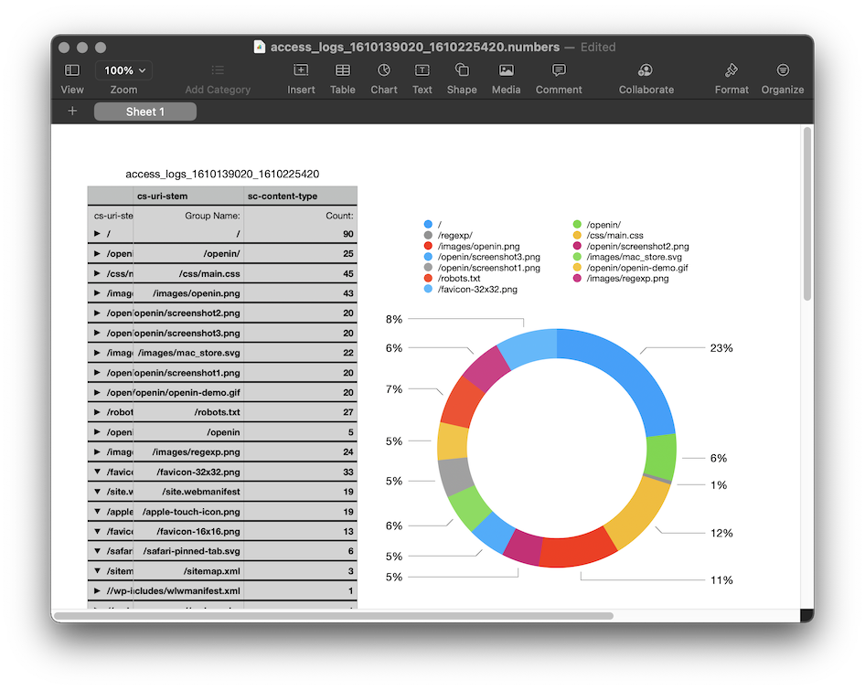
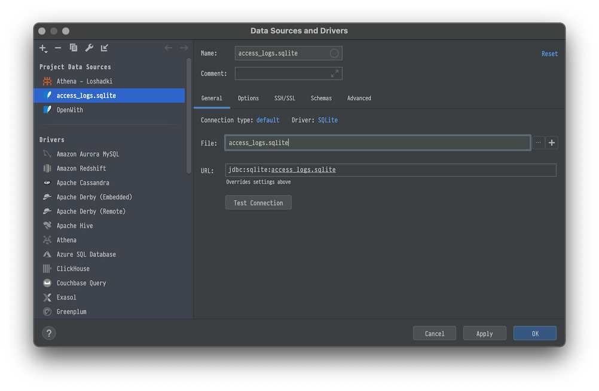
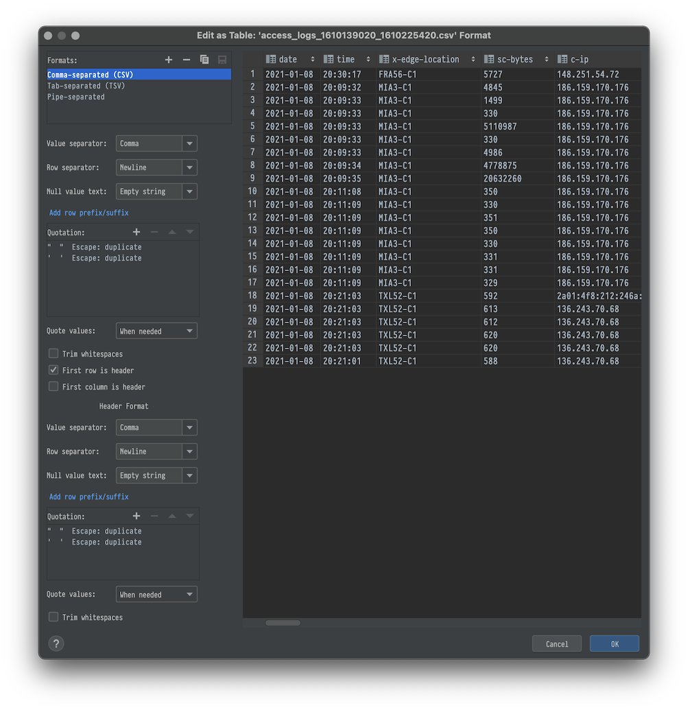
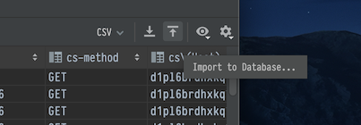
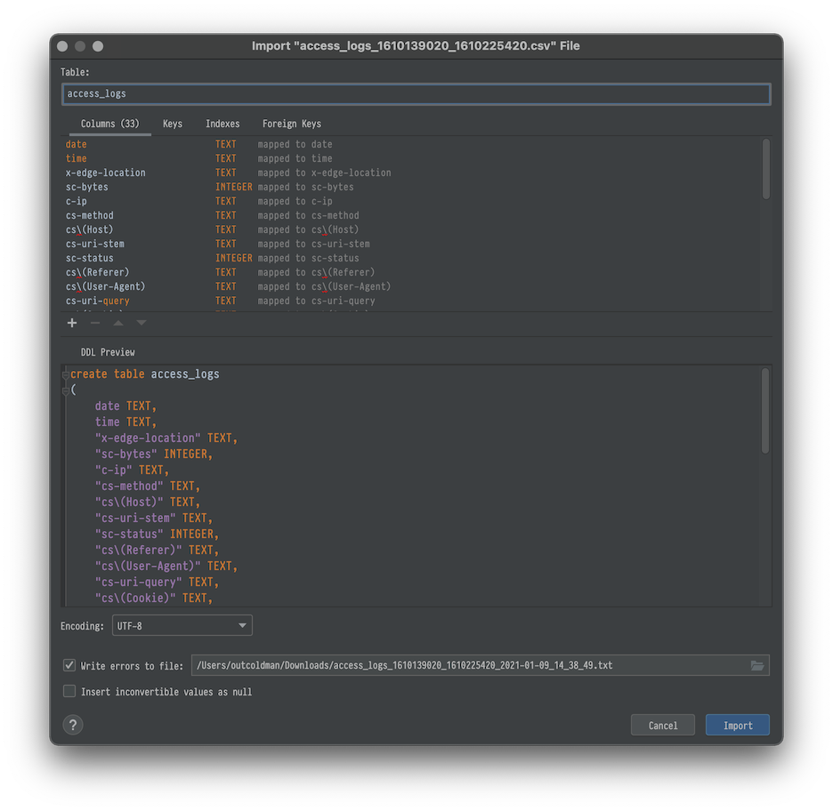
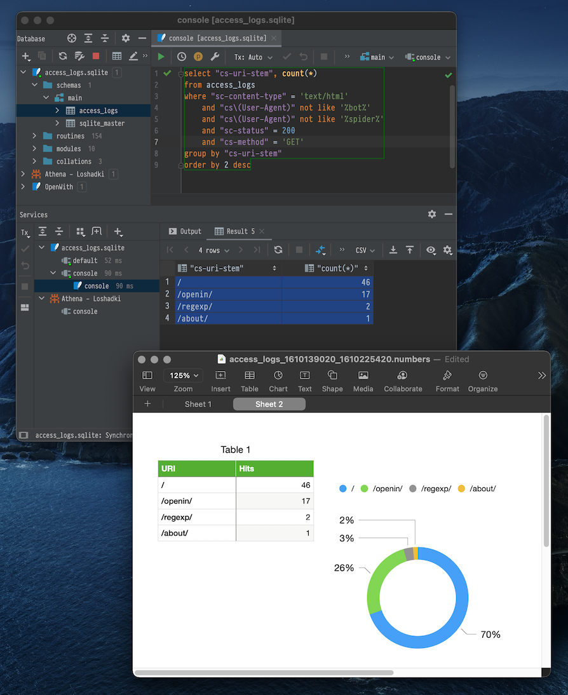
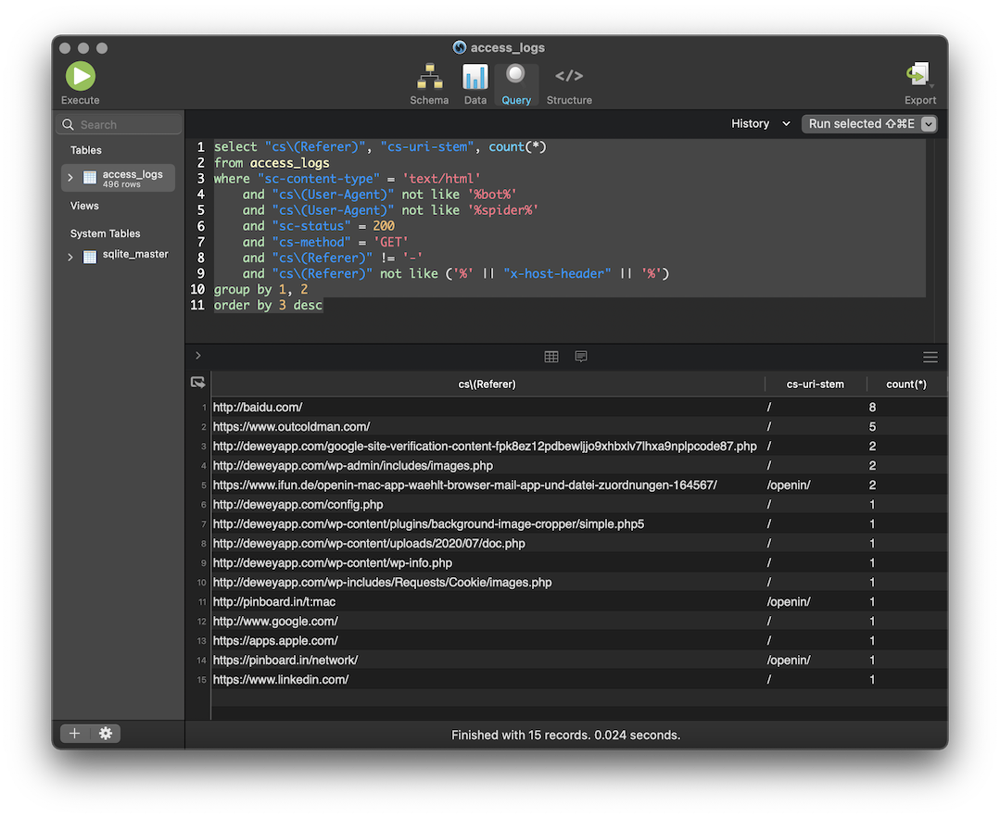

AWS has a lot of great services, that is true. But sometimes integrations between them look more like a result of
a hackathon project. One of those is the Access logs of the AWS Amplify websites.

In this set of posts, I will show you, at first how you can quickly analyze the logs locally with some common tools,
and later how you can set up a flow of exporting logs to S3, running SQL queries with Athena, and send automated emails
with the daily reports.

## Download Access logs from AWS Amplify

You can download Access logs with the Web Interface or use [AWS CLI](https://docs.aws.amazon.com/cli/index.html).

### Download Access logs from AWS Amplify with AWS CLI

> I assume you have [jq](https://stedolan.github.io/jq/) tool installed. If not, you can install it on macOS 
> with `brew install jq`. For Windows, I suggest using [scoop](https://www.outcoldman.com/en/archive/2014/07/20/scoop/).

First, list the applications. We need to get an `appId`

```bash
aws amplify list-apps | jq '.apps | .[] | {appId: .appId, name: .name}'
```

The output will be similar to

```json
{
  "appId": "YYY6dn0mprqXXX",
  "name": "loshadki-web"
}
```

You can also list domain associations if you don't remember which domain you are using for your website

```bash
aws amplify list-domain-associations --app-id YYY6dn0mprqXXX | \
  jq '.domainAssociations | .[] | .domainName'
```

The output

```text
"loshadki.app"
"loshadki.cloud"
```

And the last one, using the correct `appId` and `domain-name` we can generate a link to download the logs. We also will
configure start time as 24 hours ago till now

```bash
aws amplify generate-access-logs \
  --start-time $(date -v-24H +%s) \
  --end-time $(date +%s) \
  --app-id d366dn0mprqzhg \
  --domain-name loshadki.app
```

The output will be a JSON, containing a pretty long URL string that tells us where to get these logs

```json
{
    "logUrl": "https://xxx.us-west-2.amazonaws.com/YYY6dn0mprqXXX/loshadki.app/...."
}
```

We can also use the output directly for `curl`

```bash
curl -o access_logs_$(date -v-24H +%s)_$(date +%s).csv \
  $(\
    aws amplify generate-access-logs \
                --start-time $(date -v-24H +%s) \
                --end-time $(date +%s) \
                --app-id d366dn0mprqzhg \
                --domain-name loshadki.app | \
    jq -r '.logUrl'\
  )
```

After invoking this command, you should have Access logs in the file `access_log_{STARTTIME}_{ENDTIME}.csv`.

## Analyzing Access logs

### Numbers.app or Microsoft Excel

As crazy as it sounds, you can use the Numbers.app or Microsoft Excel for analyzing the CSV, including building Visualization.
I have tried to do something in Numbers.app, but I am not a spreadsheet ninja. You can group by, filter the data, and
visualize the data. For more information, I would suggest looking at the 
[Numbers User Guide](https://support.apple.com/guide/numbers/welcome/mac).



It is fun to do something like that, but we, developers, prefer SQL, right? 

### sqlite3 shell

> Get familiar with [Command Line Shell For SQLite](https://sqlite.org/cli.html)

You can use `csv` mode to import data from csv file and run SQL over it. The file I downloaded has a name 
`access_logs_1610139020_1610225420.csv`. To load this file in SQL use

```bash
sqlite3
```

After that, use SQLite shell to work with the data

```text
SQLite version 3.32.3 2020-06-18 14:16:19
Enter ".help" for usage hints.
Connected to a transient in-memory database.
Use ".open FILENAME" to reopen on a persistent database.
sqlite> .mode csv
sqlite> .import access_logs_1610139020_1610225420.csv access_logs
sqlite> .tables
access_logs
sqlite> .schema access_logs
CREATE TABLE access_logs(
  "date" TEXT,
  "time" TEXT,
  "x-edge-location" TEXT,
  "sc-bytes" TEXT,
  "c-ip" TEXT,
  "cs-method" TEXT,
  "cs\(Host)" TEXT,
  "cs-uri-stem" TEXT,
  "sc-status" TEXT,
  "cs\(Referer)" TEXT,
  "cs\(User-Agent)" TEXT,
  "cs-uri-query" TEXT,
  "cs\(Cookie)" TEXT,
  "x-edge-result-type" TEXT,
  "x-edge-request-id" TEXT,
  "x-host-header" TEXT,
  "cs-protocol" TEXT,
  "cs-bytes" TEXT,
  "time-taken" TEXT,
  "x-forwarded-for" TEXT,
  "ssl-protocol" TEXT,
  "ssl-cipher" TEXT,
  "x-edge-response-result-type" TEXT,
  "cs-protocol-version" TEXT,
  "fle-status" TEXT,
  "fle-encrypted-fields" TEXT,
  "c-port" TEXT,
  "time-to-first-byte" TEXT,
  "x-edge-detailed-result-type" TEXT,
  "sc-content-type" TEXT,
  "sc-content-len" TEXT,
  "sc-range-start" TEXT,
  "sc-range-end" TEXT
);
```

As an example, we can query the top 10 URL, which results in 4xx status code with the following SQL

```sql
select "cs-uri-stem", count(*)
from access_logs
where cast("sc-status" as INT) > 400
group by "cs-uri-stem"
order by 2 desc
limit 10;
```

The output of this SQL

```text
sqlite> select "cs-uri-stem", count(*)
   ...> from access_logs
   ...> where cast("sc-status" as INT) > 400
   ...> group by "cs-uri-stem"
   ...> order by 2 desc limit 10;
/app-ads.txt/,1
/administrator/,1
/admin/login.php/,1
/admin/admin.php/,1
/admin/,1
/admin.phtml/,1
//xmlrpc.php,1
//wp2/wp-includes/wlwmanifest.xml,1
//wp1/wp-includes/wlwmanifest.xml,1
//wp/wp-includes/wlwmanifest.xml,1
```

### JetBrains DataGrip

If you have a JetBrains subscription and have access to the [DataGrip](https://www.jetbrains.com/datagrip/), you can
get a slightly better interface for working with the data.

Add new Data Source and specify the name and file, for example `access_logs.sqlite`



Open CSV file in DataGrip. From the menu *Edit* → *Edit as table*. Make sure that the *First row is header* is selected.



At the top you will see *Import to Database*



We will select `access_logs.sqlite` (Just created database). And on the next step we name the table `access_logs`
and click Import.



Now we can play with the data with a more pleasant experience (this SQL example shows you top visited URLs, trying
to exclude bots and spiders)

```sql
select "cs-uri-stem", count(*)
from access_logs
where "sc-content-type" = 'text/html'
    and "cs\(User-Agent)" not like '%bot%'
    and "cs\(User-Agent)" not like '%spider%'
    and "sc-status" = 200
    and "cs-method" = 'GET'
group by "cs-uri-stem"
order by 2 desc
```

And after doing all the hard work with the SQL, it will be much easier to export data to Numbers to present it
with visualizations.



### SQLPro for SQLite

If you have [SetApp.com](https://setapp.com) subscription for macOS (if not, feel free to use my 
[referral](https://go.setapp.com/invite/wtefwi79), which will give you one month of free trial instead of 7 days).
Or maybe you already have access to [SQLPro Studio](https://www.sqlprostudio.com), you can use it as well.

Create a new SQLite database. Switch to query, and let's create a new table by running the following query

```sql
create table access_logs
(
	date TEXT,
	time TEXT,
	"x-edge-location" TEXT,
	"sc-bytes" INTEGER,
	"c-ip" TEXT,
	"cs-method" TEXT,
	"cs\(Host)" TEXT,
	"cs-uri-stem" TEXT,
	"sc-status" INTEGER,
	"cs\(Referer)" TEXT,
	"cs\(User-Agent)" TEXT,
	"cs-uri-query" TEXT,
	"cs\(Cookie)" TEXT,
	"x-edge-result-type" TEXT,
	"x-edge-request-id" TEXT,
	"x-host-header" TEXT,
	"cs-protocol" TEXT,
	"cs-bytes" INTEGER,
	"time-taken" REAL,
	"x-forwarded-for" TEXT,
	"ssl-protocol" TEXT,
	"ssl-cipher" TEXT,
	"x-edge-response-result-type" TEXT,
	"cs-protocol-version" TEXT,
	"fle-status" TEXT,
	"fle-encrypted-fields" TEXT,
	"c-port" INTEGER,
	"time-to-first-byte" REAL,
	"x-edge-detailed-result-type" TEXT,
	"sc-content-type" TEXT,
	"sc-content-len" TEXT,
	"sc-range-start" TEXT,
	"sc-range-end" TEXT
);
```

After that, use the Menu *Data*→*Import*→*CSV* and select the original CSV file. It should automatically map all the columns
to the correct columns of the `access_logs` table.

Now we can play to run the following query to show the referers for our site

```sql
select "cs\(Referer)", "cs-uri-stem", count(*)
from access_logs
where "sc-content-type" = 'text/html'
    and "cs\(User-Agent)" not like '%bot%'
    and "cs\(User-Agent)" not like '%spider%'
    and "sc-status" = 200
    and "cs-method" = 'GET'
    and "cs\(Referer)" != '-'
    and "cs\(Referer)" not like ('%' || "x-host-header" || '%')
group by 1, 2
order by 3 desc
```



## What is next?

It is a pretty nice way to look at the access logs and analyze them quickly. It works perfectly when you are developing 
a website or want to run the ad-hoc one-time query. But if you want to monitor your website constantly, you need 
to have something better. In the next part, we configure a flow for uploading the logs to Athena to have historical 
access to this data.
