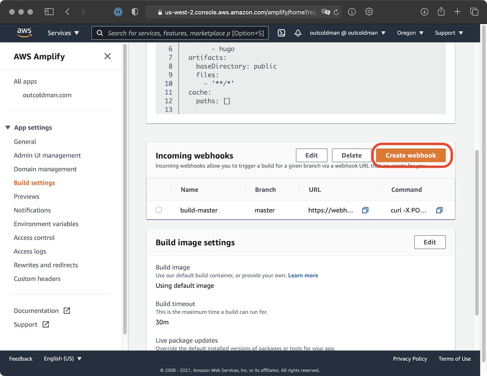

At the beginning of this year, I moved my blog to AWS Amplify and started to use Hugo as a static site generator.
Often, I write several blog posts, but I usually don’t want to post them all at the same time, so I write them for 
the future. Like any other lazy developer, I want to automate the process of automatically posting new blog posts.

Hugo is smart, and by default it does not render posts that are in the future. You can change it with the
[buildFuture](https://gohugo.io/getting-started/configuration/) attribute.

It took me a while to find a way to trigger a build without making any changes to the master branch. I looked at first
in the `aws amplify`, nothing. It turns out you can create an incoming webhook in the web console.



After you get the URL of the webhook, we can use a Lambda function to trigger it on schedule. Just make sure to change
the URL to the one you got from AWS Amplify. Below is the code for triggering the webhook using a python Lambda function.


```python
import json
import urllib.request

def lambda_handler(event, context):
    r = urllib.request.Request(
        'https://....amazonaws.com/prod/webhooks?id=...&token=...&operation=startbuild',
        data=json.dumps({}).encode('utf8'),
        headers={
            'Content-Type': 'application/json'
        },
        method='POST'
    )
    urllib.request.urlopen(r)
    return
```

After that you can create a trigger with *EventBridge (CloudWatch Events)*. In my case I use cron schedule `cron(0 8 ? * THU *)`,
which runs every Thursday at 8am UTC. 