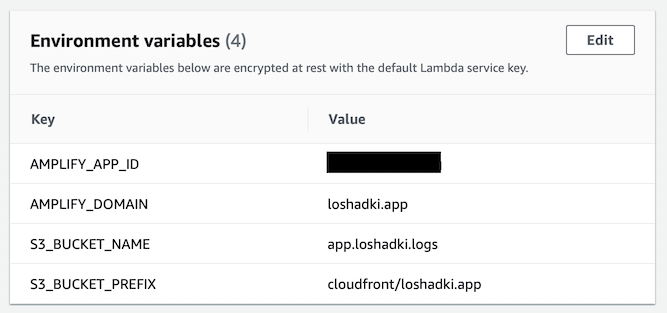
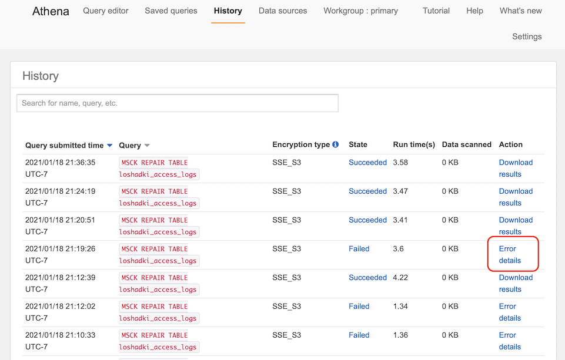

We discussed how to download AWS Amplify access logs and analyze them locally in the first part. In this part, we will 
configure a constant flow of access logs to S3 storage and create AWS Athena tables to analyze the logs.

To constantly upload access logs to S3, we will use a Lambda function that we will call hourly. We will partition 
the data daily, which will allow us to store data for years and efficiently use AWS Athena 
(See [Partitioning Data](https://docs.aws.amazon.com/athena/latest/ug/partitions.html)).
Because we will keep data partitioned, we will create a second Lambda function that will update the partitions.

## Preparation

Ensure you have an S3 Bucket where you want to store access logs (mine is `app.loshadki.logs`) and S3 Buckets to store AWS 
Athena results (mine is `app.loshadki.athena`). For the S3 bucket that stores AWS Athena results, I also configure the 
lifetime policies to delete all the data after 7 days.

Find the App Id of your AWS Amplify application. You can find it in Web Console in General tab under App ARN in format 
`arn:aws:amplify:us-west-2:016660293688:apps/APP_ID`. Another option is to run AWS CLI to find it

```bash
aws amplify list-apps | jq '.apps | .[] | {appId: .appId, name: .name}'
```

## Lambda Function for uploading Access logs

In the Web Console, **AWS Amplify**->***Access logs*** page, I have seen a note 
*Latest logs can take up to an hour to appear*.
Because of that, I have decided always to upload the access logs for the period at least an hour before my 
functions are invoked.

Create a new AWS Lambda function. I use `python:3.8`. I call mine `amplify-loshadki-web-logs`. Change the timeout
for this Lambda function to something higher than the default. I use `5 minutes`, considering that operations of downloading
the access logs and transferring them to S3 can take some time.

### Environment variables

Add environment variables to the Lambda Functions. I configure some parameters with them, so you don't have to change 
anything in the lambda function itself.

- `AMPLIFY_APP_ID` - application Id of the AWS Amplify website, should be similar to `XXXXdn0mprXXXX`
- `AMPLIFY_DOMAIN` - domain for which we want to stream access logs, in my case it is `loshadki.app`
- `S3_BUCKET_NAME` - bucket name where we want to store logs, I use `app.loshadki.logs`
- `S3_BUCKET_PREFIX` - prefix for partitioned logs, I use `cloudfront/loshadki.app`, where the last part of
the path is a domain name.
  


### Permissions

We need to update permissions for the Lambda function. We need to give it access to generate access logs for the AWS 
Amplify application and put objects on S3 buckets, where we want to store logs. Open autogenerated Role, and add inline 
Permission. Make sure to replace:

- `XXX66029XXXX` with your AWS Account Id
- `XXXXdn0mprXXXX` with the AWS Amplify App Id
- `app.loshadki.logs` with S3 Bucket you are planning to use for storing Access logs
- `cloudfront/loshadki.app` with the prefix you want to use for storing Access logs in the S3 Bucket

```json
{
    "Version": "2012-10-17",
    "Statement": [
        {
            "Effect": "Allow",
            "Action": [
                "s3:PutObject"
            ],
            "Resource": [
                "",
                "arn:aws:s3:::app.loshadki.logs/cloudfront/loshadki.app/*"
            ]
        },
        {
            "Effect": "Allow",
            "Action": [
                "amplify:GenerateAccessLogs"
            ],
            "Resource": "arn:aws:amplify:us-west-2:XXX66029XXXX:apps/XXXXdn0mprXXXX/accesslogs/*"
        }
    ]
}
```

### Source code

Add the following source code to your lambda function. After saving it, you can Deploy and Test it.

```python
import os
import os.path
import json
import boto3
import datetime
import tempfile
import urllib.request


def lambda_handler(event, context):
    event_time = datetime.datetime.strptime(event["time"], "%Y-%m-%dT%H:%M:%SZ")
    
    access_logs_endtime = event_time.replace(microsecond=0, second=0, minute=0) - datetime.timedelta(hours=1)
    access_logs_starttime = access_logs_endtime - datetime.timedelta(hours=1)
    
    amplify = boto3.client('amplify')
    result = amplify.generate_access_logs(
        startTime=access_logs_starttime,
        endTime=access_logs_endtime,
        domainName=os.getenv('AMPLIFY_DOMAIN'),
        appId=os.getenv('AMPLIFY_APP_ID')
    )
    
    response = urllib.request.urlopen(result["logUrl"])
        
    s3_client = boto3.client('s3')
    s3_client.upload_fileobj(
        response, 
        os.getenv('S3_BUCKET_NAME'),
        os.path.join(
            os.getenv('S3_BUCKET_PREFIX'),
            'year={}/month={}/day={}/access_logs-{}-{}.csv'.format(
                access_logs_starttime.strftime("%Y"),
                str(access_logs_starttime.month).zfill(2),
                str(access_logs_starttime.day).zfill(2),
                access_logs_starttime.strftime("%H"),
                access_logs_endtime.strftime("%H")
            )
        )
    )
    
    return
```

### Trigger

Add an hourly trigger to this function to constantly upload AWS Amplify Access logs to S3. Add a 
**EventBridge (CloudWatch Events)** trigger with a cron job with event schedule `rate(1 hour)`.

## AWS Athena

If you run the AWS Lambda function at least once (counting testing), you should have one file uploaded to S3. We can 
go to the AWS Athena and try to run some queries against it.


### Create a table

We can create an AWS Athena table by following their guide
[Querying Amazon CloudFront Logs](https://docs.aws.amazon.com/athena/latest/ug/cloudfront-logs.html#create-cloudfront-table).
Just with small modifications, to take into account that we are partitioning the table by `year`, `month`, and `day`.
Make sure to replace `app.loshadki.logs` to your bucket name, and `cloudfront/loshadki.app` with the prefix you have decided
to use for storing Access logs on S3. And `loshadki_access_logs` to the name of the table you want to use.

```sql
CREATE EXTERNAL TABLE default.loshadki_access_logs(
  `date` date, 
  `time` string, 
  `location` string, 
  `bytes` bigint, 
  `request_ip` string, 
  `method` string, 
  `host` string, 
  `uri` string, 
  `status` int, 
  `referrer` string, 
  `user_agent` string, 
  `query_string` string, 
  `cookie` string, 
  `result_type` string, 
  `request_id` string, 
  `host_header` string, 
  `request_protocol` string, 
  `request_bytes` bigint, 
  `time_taken` float, 
  `xforwarded_for` string, 
  `ssl_protocol` string, 
  `ssl_cipher` string, 
  `response_result_type` string, 
  `http_version` string, 
  `fle_status` string, 
  `fle_encrypted_fields` int, 
  `c_port` int, 
  `time_to_first_byte` float, 
  `x_edge_detailed_result_type` string, 
  `sc_content_type` string, 
  `sc_content_len` bigint, 
  `sc_range_start` bigint, 
  `sc_range_end` bigint)
PARTITIONED BY ( 
  `year` int, 
  `month` int, 
  `day` int)
ROW FORMAT DELIMITED 
  FIELDS TERMINATED BY ',' 
STORED AS INPUTFORMAT 
  'org.apache.hadoop.mapred.TextInputFormat' 
OUTPUTFORMAT 
  'org.apache.hadoop.hive.ql.io.HiveIgnoreKeyTextOutputFormat'
LOCATION
  's3://app.loshadki.logs/cloudfront/loshadki.app'
TBLPROPERTIES (
  'skip.header.line.count'='1')
```

### Views

I create 4 views for myself, which helps me quickly access only data specific date period. As you would see, I use the prefix
`loshadki` (as my domain name), and table `default.loshadki_access_logs` as I created in a previous step. Make sure to update
it to your needs.

#### Today

```sql
CREATE OR REPLACE VIEW loshadki_access_logs_today AS 
SELECT *
FROM
  default.loshadki_access_logs
WHERE ((("year" = "year"(current_date)) 
            AND ("month" = "month"(current_date))) 
            AND ("day" = "day"(current_date)))
```

#### Yesterday

```sql
CREATE OR REPLACE VIEW loshadki_access_logs_yesterday AS 
SELECT *
FROM
  default.loshadki_access_logs
WHERE ((("year" = "year"("date_add"('day', -1, current_date))) 
        AND ("month" = "month"("date_add"('day', -1, current_date)))) 
        AND ("day" = "day"("date_add"('day', -1, current_date))))
```

#### Last week

```sql
CREATE OR REPLACE VIEW loshadki_access_logs_week AS 
SELECT *
FROM
  default.loshadki_access_logs
WHERE ("from_iso8601_date"(
    "concat"(
        CAST("year" AS varchar), '-', 
        "lpad"(CAST("month" AS varchar), 2, '0'), '-', 
        "lpad"(CAST("day" AS varchar), 2, '0'))
    ) >= "date_add"('week', -1, current_date))
```

#### Last month

```sql
CREATE OR REPLACE VIEW loshadki_access_logs_month AS 
SELECT *
FROM
  default.loshadki_access_logs
WHERE ("from_iso8601_date"(
    "concat"(
        CAST("year" AS varchar), '-', 
        "lpad"(CAST("month" AS varchar), 2, '0'), '-', 
        "lpad"(CAST("day" AS varchar), 2, '0'))
    ) >= "date_add"('month', -1, current_date))
```

### Manually update partitions

Because we are partitioning the data by day, we need to tell Athena to update those partitions. It is useful to keep 
data partitioned for reducing the cost of running AWS Athena queries. AWS charges us per data read from S3. When we 
partition data by days, we can tell Athena to only load data from specific partitions, reducing the amount of data 
that AWS Athena needs to read.

We can update partitions with the following SQL command

```sql
MSCK REPAIR TABLE default.loshadki_access_logs;
```

Make sure to update the name of the table `loshadki_access_logs` to the table name you decided to use.

### Querying the data

You should be able to query the data now. For example, this is a Query to look at the top Referrers.

```sql
select "referrer", "uri", count(*)
from default.loshadki_access_logs_yesterday
where "sc_content_type" = 'text/html'
    and "user_agent" not like '%bot%'
    and "user_agent" not like '%spider%'
    and "status" = 200
    and "method" = 'GET'
    and "referrer" != '-'
    and "referrer" not like ('%' || "host_header" || '%')
group by 1, 2
order by 3 desc
```

## Updating partitions automatically with Lambda function

Considering that we are partitioning the data by day, we will create a new partition every day. You can update it 
manually with SQL with used previously

```sql
MSCK REPAIR TABLE default.loshadki_access_logs;
```

But we can also create a Lambda function that we will run every day to update the partitions on the table.
Create a new Lambda function. I call it `athena-loshadki-update-partitions`, use `python:3.8`.

### Environment variables

Add the following environment variables

- `ATHENA_DATABASE` - in my case it is `default`
- `ATHENA_TABLE_NAME` - in my case it is `loshadki_access_logs`
- `S3_OUTPUT_LOCATION` - this is where the Athena query results will be written. In our case, we don't have any results, really.
But it is required for any Query.
I just use the standard location for all the Athena query results, which is `s3://app.loshadki.athena/` in my case.

### Permissions

Permissions are tricky in this situation. We only call an Athena API `StartQueryExecution`, but everything this query 
will touch will be run under permissions of this Lambda function, so we need read-only permissions to our partitions' 
location (access logs). Write only access to where Athena is going to write the output. And also read-only access to Glue.

This is how permissions look for me at the end. Make sure to update the CloudWatch logs' resource, a location where your 
access logs are stored, and where you plan to write Athena query results.

```json
{
    "Version": "2012-10-17",
    "Statement": [
        {
            "Effect": "Allow",
            "Action": [
                "logs:CreateLogStream",
                "logs:PutLogEvents"
            ],
            "Resource": "arn:aws:logs:us-west-2:XXX66029XXXX:log-group:/aws/lambda/athena-loshadki-update-partitions:*"
        },
        {
            "Effect": "Allow",
            "Action": [
                "logs:CreateLogGroup"
            ],
            "Resource": "arn:aws:logs:us-west-2:XXX66029XXXX:*"
        },
        {
            "Effect": "Allow",
            "Action": [
                "s3:Get*",
                "s3:List*"
            ],
            "Resource": [
                "arn:aws:s3:::app.loshadki.logs",
                "arn:aws:s3:::app.loshadki.logs/cloudfront/loshadki.app/*"
            ]
        },
        {
            "Effect": "Allow",
            "Action": [
                "s3:Put*"
            ],
            "Resource": [
                "arn:aws:s3:::app.loshadki.athena/*"
            ]
        },
        {
            "Effect": "Allow",
            "Action": [
                "athena:StartQueryExecution",
                "glue:Get*"
            ],
            "Resource": "*"
        }
    ]
}
```

### Source code

Add the following source code to your function.

```python
import boto3
import uuid
import os

def lambda_handler(event, context):
    client = boto3.client('athena')
    response = client.start_query_execution(
        QueryString='MSCK REPAIR TABLE ' + os.getenv("ATHENA_TABLE_NAME"),
        QueryExecutionContext={
            'Database': os.getenv('ATHENA_DATABASE')
        },
        ResultConfiguration={
            'OutputLocation': os.getenv('S3_OUTPUT_LOCATION'),
            'EncryptionConfiguration': {
                'EncryptionOption': 'SSE_S3'
            }
        }
    )
    print(response)
    return
```

Now Deploy and Test it.  Even if you miss some permissions, this Lambda function will probably
succeed. Because here I only tell this function to start the query, but never check the result.

You can check the query result in the AWS Athena Web console, in the History tab.



### Create a trigger

Similar to the previous Lambda function. Add a trigger to this function to run it daily. Add a
**EventBridge (CloudWatch Events)** trigger with a cron job with event schedule
Cron `cron(30 3 * * ? *)`. I run it at `3:30` UTC time every day to update the partition. Considering how I run the
Lambda function for uploading the access logs, seems like the latest when a new partition can be created is `2:59`.
But taking into account, that function can fail and be retried, and take up to 5 minutes to upload those files,
I added 31 minutes for safety.

## Summary

At this point, we configured a flow of logs from AWS Amplify to S3 and configured AWS Athena for querying these logs. 
In the next part, we will find a way to generate reports.

I guess this time I will give you some homework. There is a lot of things that can be improved for the real production code:

- You can write access logs in gzipped instead of simple CSV, which will save you storage on S3, and require
  Athena to read fewer data from S3, and you are paying for how much Athena reads from S3.

- The lambda function that updates the partitions does not check the execution results. You can use `GetQueryExecution`
  in the loop to wait when the query succeeds and fail if it does not. Currently, the only way to check that query worked is to
  go to the Athena History tab and verify results.