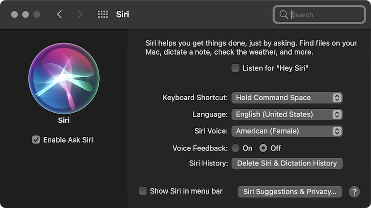
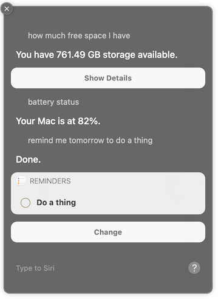

I have been using [Alfred](https://www.alfredapp.com) for a long time. If you have not heard about Alfred, the short description is a Spotlight on 
steroids. It can do a lot, but you have to write your own Workflows or find if somebody already built it to use some 
of the really cool features. And I wrote some a long time ago, but to be honest, lately, I noticed that I don't use it 
much, except to open applications and a few workflows. And the Spotlight improved significantly with the last few 
versions of MacOS. So I have decided to achieve almost anything I need with the Spotlight (Siri and Automator) 
instead of Alfred. 

## Step 1. Siri for advanced workflows

Apple is really pushing us to turn on Siri after each update of MacOS. So I finally did. In the System Preferences, 
Siri preferences, I have enabled Ask Siri, disabled Listen for "Hey Siri", and set a Keyboard Shortcut to `⇧⌘Space`.

But I don't really want to talk to her. Instead, I want to use text input to be able to tell, "Remind me tomorrow to 
do a thing" or "Show me the weather in Boulder". Open System Preferences again, Accessibility, and Select Siri under 
General. Check the "Enable Type to Siri".

Now you can open Siri dialog with `⇧⌘Space` and start typing various things like 

Just that eliminated so many workflows from Alfred and added so many new.

## Step 2. Automator

Some of my Alfred workflows are very specific, where Siri cannot help me. One of which I probably use most is to strip 
formatting from the Rich Text. This workflow basically uses the shell command `pbpaste | pbcopy`.

I have finally opened an Automator for the first time and created a Quick Action to do precisely the same.

I saved this action with the name "Paste Stripped". And configured a shortcut for it in System Preferences, 
Keyboard, Shortcuts `⇧⌘V`.

## Step 3. Spotlight

And the last step. Disable Alfred auto-launch or delete it. And put Spotlight on `⌘Space` or a different combination 
of your choice. The only configuration I have done for Spotlight is that I turned off 
[Siri's suggestions](https://support.apple.com/guide/mac-help/turn-off-siri-suggestions-for-spotlight-mchl62db64f5/mac), 
as I don't see them useful.  