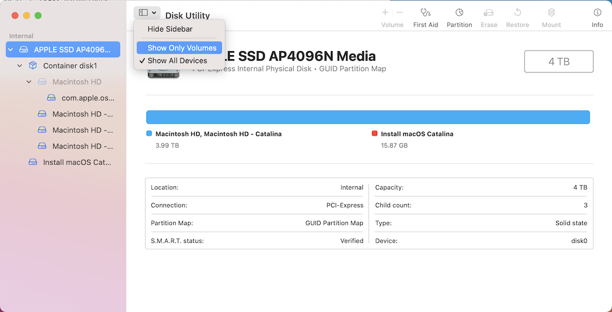
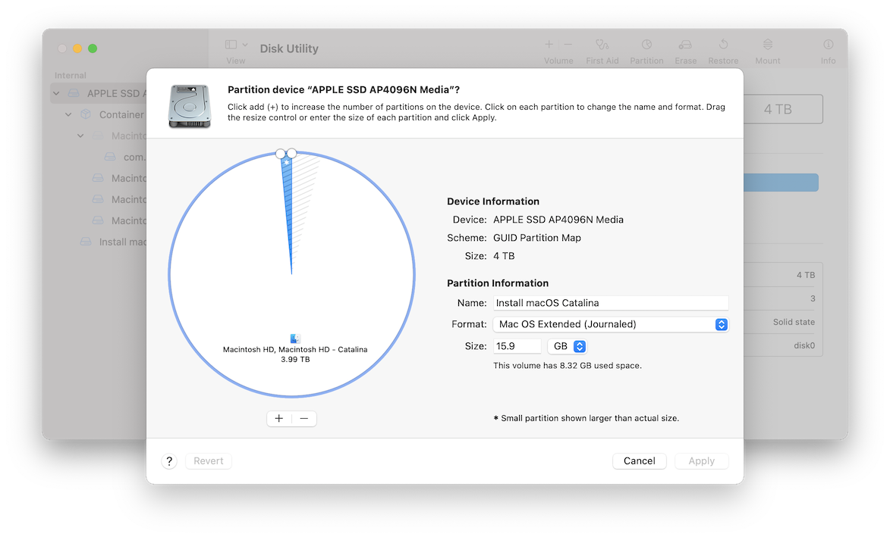
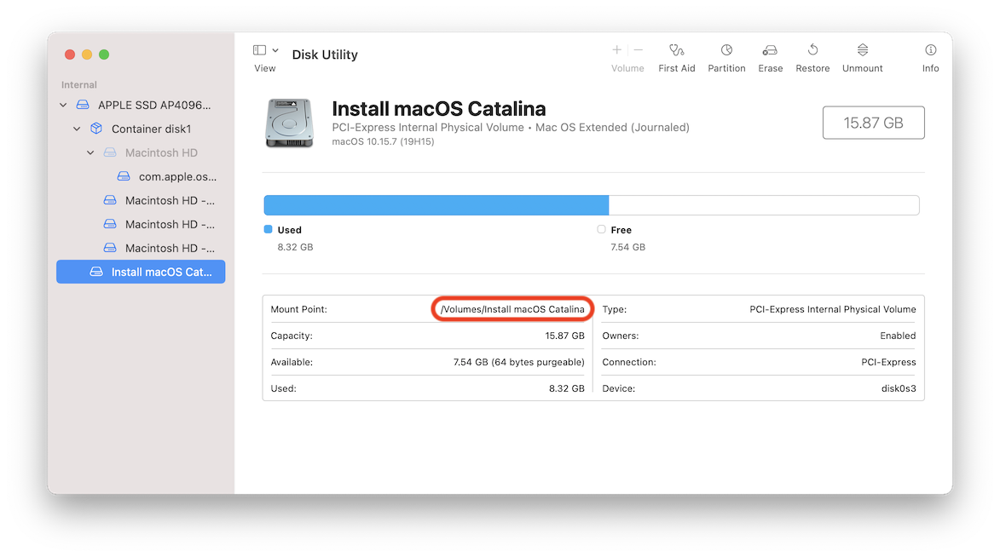
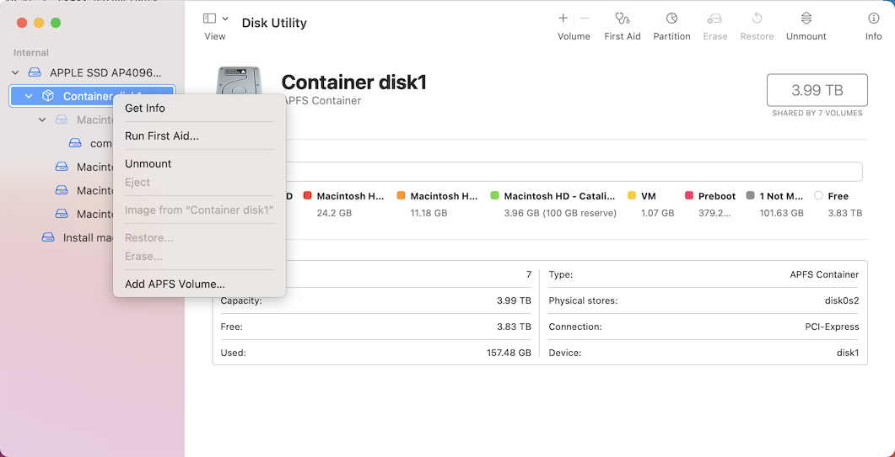

In the last three and a half months, I kept enjoying my MacBook Pro 13" M1, battery life, performance; everything is on
the top level. But I also have an MBP 16 2019 that I have been using for development before. This Mac is a top-loaded
MBP that I could buy at that time with the price of close to $5,000. I tried to sell it, but most folks are trying to
lowball me to 2,000. The Apple Trade-In program is also willing to give me $1,750 for the laptop I bought a little over
a year ago.

I have decided to look at the better options to use it. My recent hobby is making macOS and iOS applications ([loshadki.app](https://loshadki.app)). With iOS,
it is pretty easy to test applications on previous iOS devices. You can download a simulator down to iOS 10. With macOS,
it is more complicated. You can use Parallels to test applications on the previous macOS, but the experience is not that
great. Performance is not even close to the macOS installed directly on Mac.

So I have decided to try installing multiple macOS versions on the same Mac finally. And it turns out it is pretty
straightforward. You don’t even need to have a Flash Drive.

## Step 1. Download available macOS versions

I have started with the fresh install of Big Sur. In terminal you can run

```bash
softwareupdate --list-full-installers
```

Considering that this Mac was released in Late 2019, the only macOS versions I can see are Big Sur and Catalina. In my
case I have downloaded the latest Catalina.

```bash
software update --download --fetch-full-installer --full-installer-version 10.15.7
```

## Step 2. Partitioning for macOS Catalina Installer

I assume if you have one of the latest macOS versions installed, your drive is partitioned as APFS.

You cannot create a bootable APFS container from the macOS installer, so we will create a partition with Format
"Mac OS Extended (Journaled)" for the installer.



Open the Disk Utility. In the View Change it to "Show All Devices". Select the "APPLE SSD ..." at the top level. Right-click on partition, click
"+" to add a new partition. This is just for the installer, so you can make it 16GB. I named it "Install macOS Catalina" and
set the Format to "Mac OS Extended (Journaled)"



This operation might take a while, and your Mac can freeze for a short period. After this partition is created,
check the Mount Point.



## Step 3. Create Bootable partition

In the terminal using the Catalina installer, make a partition, that we just created, bootable

```bash
sudo /Applications/Install\ macOS\ Catalina.app/Contents/Resources/createinstallmedia --volume /Volumes/Installer\ macOS\ Catalina
```

At this point you have a bootable partition which you can use to install macOS Catalina.

## Step 4. Create a separate APFS volume for secondary OS

Go back to the Disk Utility. Click on the Container disk N (in my case it is just 1). With the context menu select "Add APFS Volume...".
I gave my volume a name "Macintosh HD - Catalina", kept format APFS. You can also change the Size Options to reserver and limit the size.



## Step 5. Install macOS Catalina on the Volume

Restart your Mac by holding the "⌥" key (alt/option). You will see a selection for the hard drive. You should see a partition of
your main MacOS (Macintosh HD) and just created partition "Install macOS Catalina". Select that, and in the installation steps
select destination volume as "Macintosh HD - Catalina".

After installation you will be able to reboot, and while Mac is booting you can hold the "⌥" key (alt/option) to select the
macOS you want to boot in.