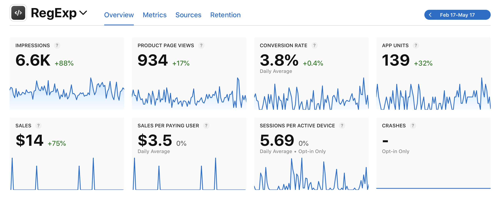
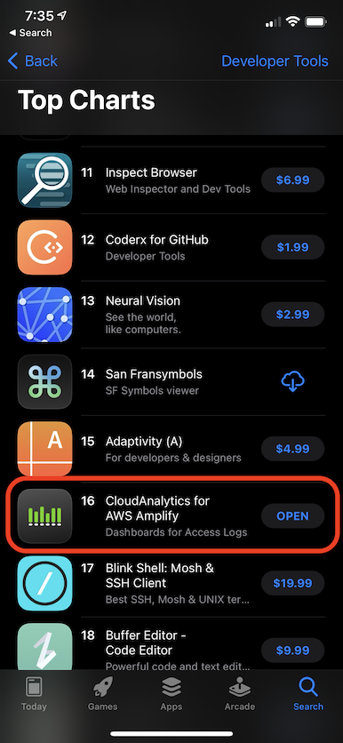
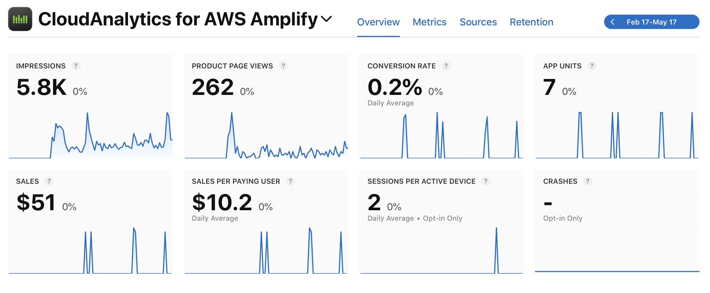
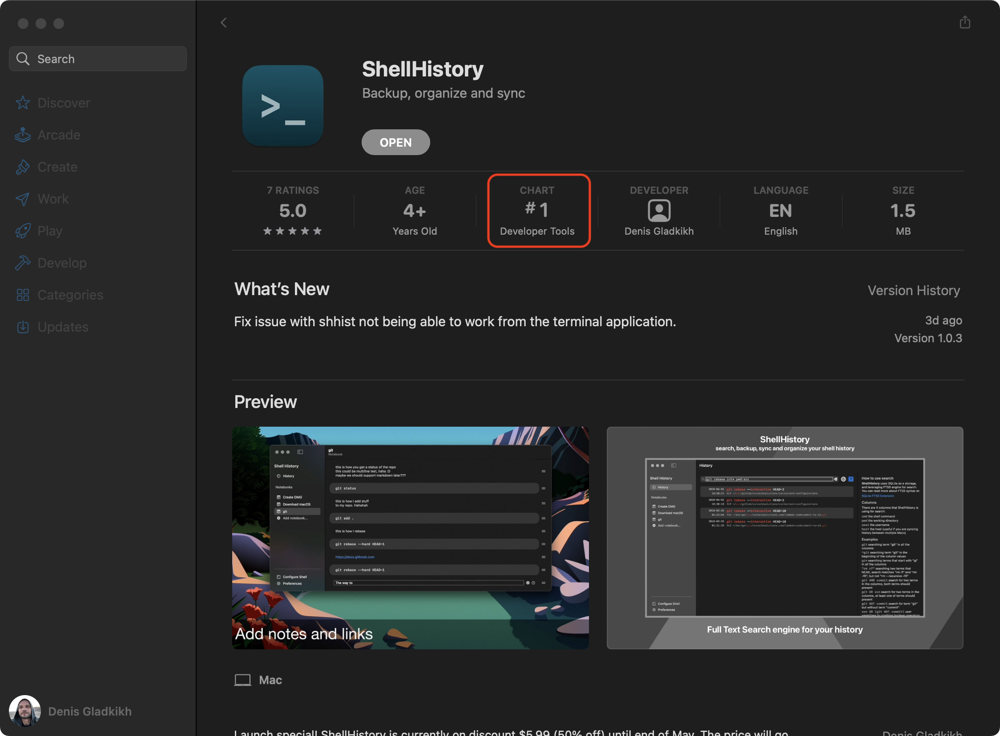
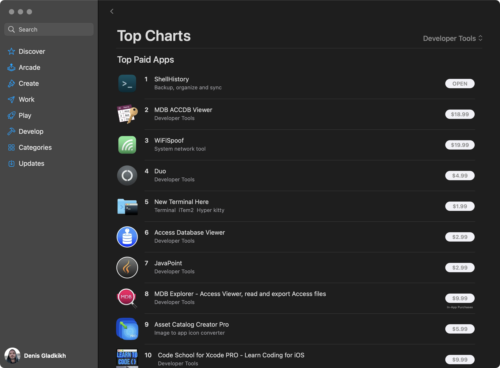
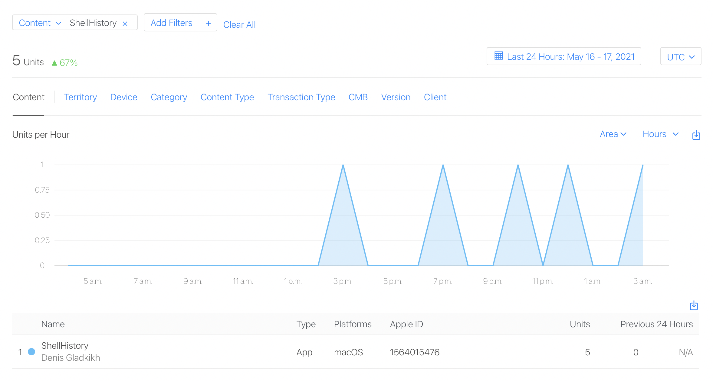
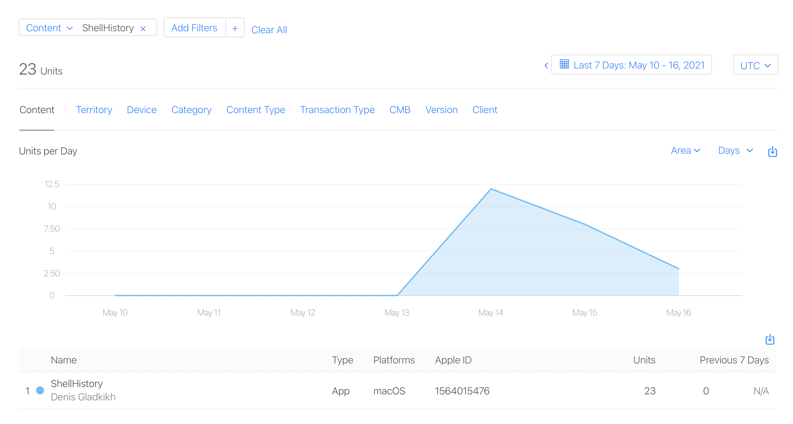

I love building developer tools and utilities. And, I believe the reason is simple, because I am a developer, and 
those tools I make, I create first of all for myself. I worked for Microsoft before on Visual Studio. 

I worked in Splunk on some work related to the developers (App Platform). I can say that I had some experience 
building developer tools by learning from large corporations.

For the last 3-4 years, I work for myself. Build a successful B2B company, and now I have the flexibility sometimes 
to explore other options.

As a hobby now, I am building macOS/iOS applications. And primary they are Utilities, Productivity and Developer Tools. 
Some of my applications got in the Top Charts on macOS and iOS App Stores. I would love to share some information 
with you, including analytics.

The purpose of this blog post to give you an expectation of how much you can earn by building developer tools. 
I, personally, expected that. The results do not discourage me from continuing my work.

## RegExp - ~#100 - Free Apps - Developer Tools - Mac App Store

[RegExp](https://loshadki.app/regexp/) was the first application that I have built for Mac. The idea behind this app was to make a Regular Expression 
tester that can use go language flavor.

This app still requires a lot of polishing, as SwiftUI is not very friendly with Text inputs like you cannot easily 
set the focus to input controls, you cannot easily copy text from just text blocks. But it serves the purpose for me: 
I can test Regular Expressions offline with the Go language flavor.

I do not have the screenshot for when this application was around #100 in the Free Apps under the Developer Tools category. 
Right now, it is below #200, so I do not know exactly.

Some summaries from the 90-days analytics below:

- In 90 days this app was downloaded 139 times.
- There are some features under In-App-Purchase, so I have made $14 from them during 90 days.

## Cloud Analytics for AWS Amplify - #16 - Paid Apps - Developer Tools - iOS App Store

I started to use AWS Amplify for all my websites with Hugo as a static site generator. I wanted to find a way to 
run analytics for my websites using the Access Logs provided by AWS Amplify. At first, I tried to use AWS native 
tools: Lambdas, S3, Athena, and QuickSight.  And you can find some blog posts about this on this website, but by 
the time I got to QuickSight, I just gave up. Too much manual work, and you cannot quickly reproduce it for multiple 
websites.

That is where I came up with the idea to build another Mac app, and at that time, I decided to make iPadOS and iOS 
versions as well.

[CloudAnalytics for AWS Amplify](https://loshadki.app/cloudanalytics/) is a particular app that would not have many users, 
but I primarily made it for myself, and it serves me pretty well.

To my surprise, I have found that this app was in the list of Top Paid applications under the Developer Tools category on iOS.

Why surprise? Look at the analytics below. From 90 days, I sold 7 copies (two of which were me using Promo codes), 
and in reality, I sold only 5. A quick note, this app is not even close to the top on iPadOS and Mac App Stores. 
There is no point in making Developer Tools for iOS unless you benefit from it.

## ShellHistory - #1 - Paid Apps - Developer Tools - Mac App Store

This week was an official launch of my new application, [ShellHistory](https://loshadki.app/shellhistory/). 
On the day of the announcement, I already made it to the Top 1st application under Paid Apps in the Developer Tools 
category in Mac App Store. 

How many downloads (purchases) does it take? Around 5. A screenshot I made when I saw that ShellHistory is a Top 1st app of the last 24 sales.

But I did have a pre-download period for my Beta testers. I silently published this app for free for a few days, so 
the Beta testers could download it for free, as my way of saying thank you for helping me with the testing of the app. 
And in exchange, I asked them to leave the reviews. To solve the problem "Chicken or the egg": sell a Paid app that 
does not have a review. 

About 30 downloads in 4 days got me in the Top of the Developers Tools on Mac App Store. 

If I had five sales per day on average, that would be around $900 (price $5.99), not bad. And it is on sale right now. 
The price will go up to $11.99 after, so that would be $1,800. But it is pretty stupid to assume that every day will be 
the same as a launch day. Many people downloaded a free trial from my website. Some of them might purchase a full version 
of the app from the App Store. I am not sure how much this app will make. That is going to be a blog post 
for another day.

## Thoughts

Does it mean that you cannot make money from selling Mac applications? Absolutely not. I have another application under 
the Productivity category, [OpenIn](https://loshadki.app/openin/). This app did not even make it to the top 200. At this moment, this is the most 
profitable application for me. It is a free application with In-App-Purchase to unlock the Pro features. I distribute 
it through the App Store and [SetApp](https://go.setapp.com/stp313?utm_medium=vendor_program&utm_source=Denis+Gladkikh&utm_content=link) store as well. I believe I am making from this application around $600 a month. 
It is just a beginning. Apps will promote each other. The sales might go up. I will make more valuable apps. 
Primarily for myself. I am sure there will be people who find them useful as well. 

I doubt that this hobby will help me to retire. But it brings me joy.

