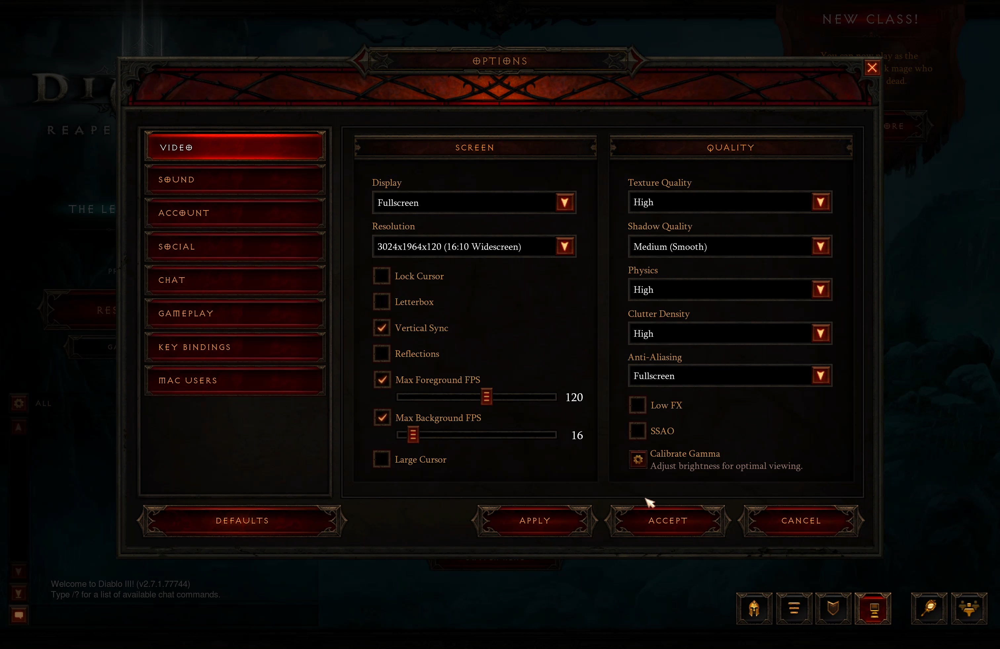
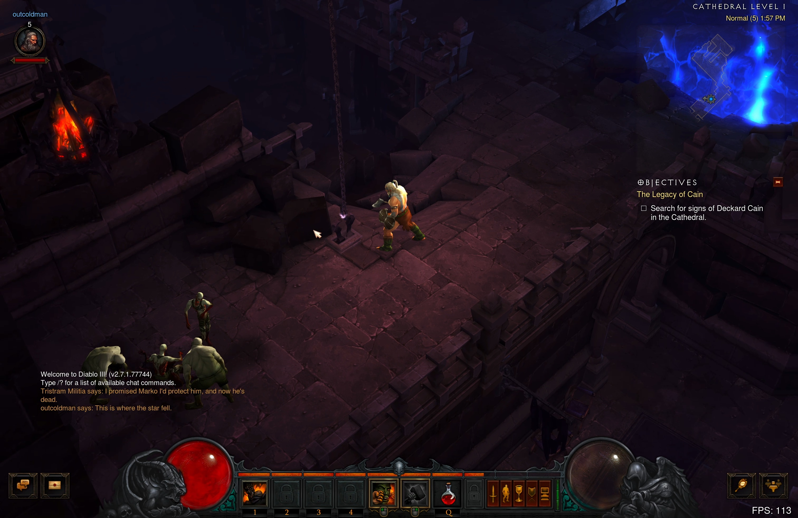
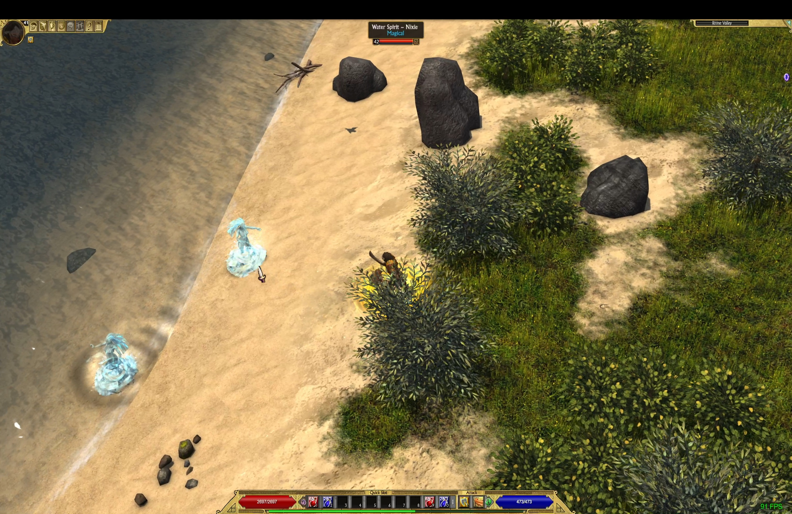
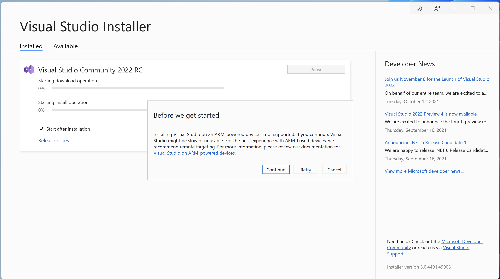
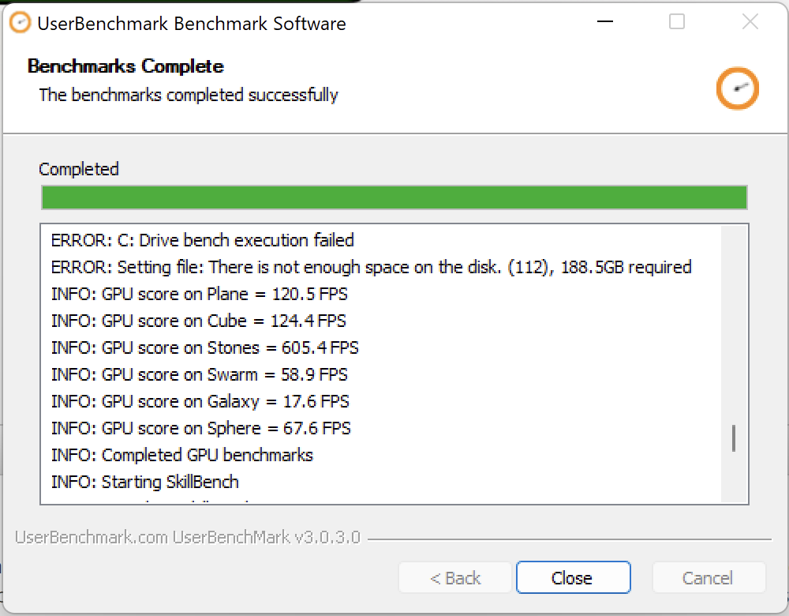

I have been using Macbook Pro with M1 since the release of the MBP 13" M1 in 2020. And I am huge fan of the new Apple CPU - M1. 
Time to time I need to do some work on my 2019 16" MBP with Intel Processor (all maxed out), so I keep experience the difference between
using those two.

On MBP with M1 I can definitely see that the macOS works way more smooth. No more glitches or frozen screens for a few
seconds, less heat, less time I hear the fans work. And a lot of work you can do on just single battery charge. 

After switching from MBP 16" 2019 to MBP M1 2020, the few things that I missed, more RAM and more Storage. I got used to having less RAM,
just running less VMs, less Docker containers, and when I need to do some stress testing with a lot of VMs, this is when
I switch back to 2019 MBP 16" with 64 GB of Memory. 

With the release of MBP 14"/16" and M1 Pro/Max chips this problem goes away too. Now I can have 64 GB, 4 TB of storage in
14" form factor, and being able to leverage great battery life of the M1 chip. Loved that with the Apple M1 chip they
can let me choose between the size of laptop without compromising the performance. With Intel chips you always had to build
16" configuration if you want the most RAM and fastest CPU. That is not a case with the M1 chips anymore. 

## Battery life of M1 Max comparing to M1

Well, you will have less battery life for sure. Not much, I would say on the regular working day, when you are just
browsing Facebook and Reddit, you get 20-30% less of the battery life. So instead of 8 hours, I would probably get
around 6-7 hours. Not really noticeably for me, to be honest. Of course, you can drain way more battery and way quicker
on M1 Max. Considering it has more 4 times more GPU cores, more CPU cores, and larger screen.

The full capacity of the battery is around 73Watt (~6000mAh*12v), when there are half of the cores are used, you see 
about ~35Watt consumption, so in about 2 hours you can drain the whole battery. While Internet browsing and code writing 
I see about 9Watt consumption, which gives us around 8 hours of the battery usage. 

Of course, you can try to get more of the battery if you try to dim the screen, watch for the background processes, etc,
but if I get on average around 6+ hours of the battery life, I will be more than happy. If you dim the screen, I can see
3-4Watt consumption in idle mode (basically reading from the screen).

## CPU Performance

Huge GPU improvement, good CPU improvement. I usually do the llvm build to test the performance, and compare how much
battery is going to be used. Both M1 and M1 Max chips used ~30% of the battery, M1 chip took 31 minutes to compile llvm,
and M1 Max chip took 21 minutes to compile it. So that gives us around 30% better CPU in multi-core test.

You can see how I do llvm builds in the previous blog post [MacBook: benchmarks for developers](https://www.outcoldman.com/en/archive/2017/07/14/macbook-benchmark/).

I run the Geekbench 5 tests on all 3 laptops I have:

- [MBP 2019 i9 - 1176 Single - 7437 Multi](https://browser.geekbench.com/v5/cpu/10768559)
- [MBP 2020 M1 - 1744 Single - 7714 Multi](https://browser.geekbench.com/v5/cpu/10768493)
- [MBP 2021 M1 Max - 1785 Single - 12472 Multi](https://browser.geekbench.com/v5/cpu/10768526)

Impressive. Both M1 and M1 Max have better Single Core CPU performance, and M1 Max has almost 40% better Multi-Core CPU
performance.

## GPU Performance

I am not doing much of the GPU work, so cannot really give you a lot here. But I tried to run Diablo III on internal
display, full resolution (excluding the notch), high settings on 120fps, and it worked smoothly. And, comparing to the
Intel laptops, very rarely you can use full potential of GPU, when you are not plugged in to the power. With M1 Max you
can actually use the full potential of GPU just running from the battery.

I also run the Geekbench 5 GPU tests on all 3 laptops

- [MBP 2019 i9 AMD Radeon Pro 5500M - 31823 Metal Score](https://browser.geekbench.com/v5/compute/3644283)
- [MBP 2020 M1 - 21501 Metal Score](https://browser.geekbench.com/v5/compute/3644264)
- [MBP 2021 M1 Max - 64320 Metal Score](https://browser.geekbench.com/v5/compute/3644250)

## Mac on Mac with Parallels

Apple released a Virtualization framework with macOS Big Sur. The latest Parallels version (17.1.0 - 51516) claims
increased performance in CPU and GPU, so I decided to give a try and see how macOS runs in Parallels. I was running
macOS Monterey 12.0.1 as host and guest VM.

If you have tried to run macOS in Virtual Machine before, you know how slow the performance is. I am running several
versions of macOS (10.15.x and 11.x) on Mac Mini with the Intel Chip to test my apps on previous versions of
macOS, and the performance of those machines are not great. 

Monterey in VM only lucks the Retina resolution, everything else is very impressive and responsive.

I run the Geekbench 5 tests inside the VM

- [CPU - 1660 Single - 7769 Multi](https://browser.geekbench.com/v5/cpu/10768367), where Parallels assigns the cores
automatically and for some reason does not allow you to change the configurations, it assigns 5 Cores, so basically
give you half of the performance of the M1 Max chip.
- [GPU - 71083 Metal Score](https://browser.geekbench.com/v5/compute/3644236), even higher than on host, my guess it is
because it does not run in Retina, and my guess, does not use ProMotion.

## Windows on Mac with Parallels

You can only run arm64 version of Windows 11 at this moment. Dev Channel. Which means this version might be very unstable.
But I gave it a try. There are a lot of issues with just clean installation. You need to figure out how to get to the
Windows Store, because for some reason it does not come in the Dev Channel.

There is a lot of questions on Reddit about using Windows with new M1 Apple Silicon. And turns out, Windows on M1 is not
as bad as I expected. First, the performance of Windows 11 running inside of Parallels is outstanding. Seriously, don't
see any lagging, everything runs perfectly and very smooth. 

Let's first highlight a few points:

- It is not a AMD64 version of Windows, it is ARM64 version, which means that programs built for AMD64 (Intel, AMD CPUs)
will run under emulation and might not work. 
- A lot of games and applications which expects more common GPU hardware might not recognize the environment and might fail.
- You cannot use WSL, as Windows 11 requires WSL 2, which uses virtualization, and Parallels does not support virtualization
inside the guest VM for M1 chips. 
- For the same reason, you cannot run Hyper-V, and I assume, probably Docker and everything else that will require nested
virtualization.

Let's see what I have tried:

- Titan Quest Anniversary Edition from Steam - 2560x1440 - all high settings, runs smoothly most of the time above 60FPS,
sometimes up to 120FPS, and drops to as low as 30FPS.

- DOOM (2016) or DOOM Eternal - both fail to launch
- Visual Studio 2022 RC1 - on installation it gives you a warning, that it is not supported on ARM-powered device, but
lets you to install it. I have not been using Visual Studio for a long time, it does feel slow, but you can work with it,
I downloaded [WPF Samples](https://github.com/microsoft/WPF-Samples) project, tried to compile it and run it, and it worked.
I would say if you need to periodically to test or maintain some VS projects, maybe Windows 11 on Parallels can actually
satisfy your needs. If you need full time working Windows environment with Visual Studio, maybe not the best option, but
cannot say for sure. 

Geekbench 5 scores:

- [CPU - Parallels on M1 Max - 1475 Single - 5025 Multi](https://browser.geekbench.com/v5/cpu/10768629)
- [CPU - Bootcamp on Intel i9 - 1187 Single - 7198 Multi](https://browser.geekbench.com/v5/cpu/10769480)
- [GPU - Bootcamp on Intel i9 - 35436 OpenCL Score](https://browser.geekbench.com/v5/compute/3644629)
- [GPU - Bootcamp on Intel i9 - 27942 Vulkan Score](https://browser.geekbench.com/v5/compute/3644649)

Unfortunately Geekbench 5 does not recognize GPU in Parallels, so I could not run any GPU tests there. But I tried to
run [UserBenchmark](https://www.userbenchmark.com), which did not allow me to upload GPU results to the database (because
it recognizes that I run it in VM), but I got some results from the log window:

M1 Max: 

- Plane - 120.5 FPS 
- Cube - 124.4 FPS
- Stones - 605.4 FPS (this is not a misprint, it is 605.4 FPS)
- Swarm - 58.9 FPS
- Galaxy - 17.6 FPS
- Sphere - 67.6 FPS

Compare it to the Windows 10 in Bootcamp running on Intel with AMD Radeon Pro 5500M:

- Plane - 50.5 FPS
- Cube - 53.2 FPS
- Stones - 74.4 FPS
- Swarm - 33.7 FPS
- Galaxy - 55.8 FPS
- Sphere - 43 FPS

Not sure what every test represents (I assume different DirectX version and so on), but you can see that in most tests,
except one, M1 Max in Parallels outperforms AMD Radeon Pro 5500M running in Bootcamp. 

So in conclusion. Windows on M1 Max exists, you can run some old games inside Parallels, you can run some applications.
And performance is way better than I expected. But, Windows 11 on M1 or inside Parallels is not supported by Microsoft,
they might take away licensing even for Dev Channel. It does seem like even GPU performance of Windows, running in Parallels
is on the level or better than running Bootcamp on Intel with AMD Radeon Pro 5500M, but at this point it all depends
on drivers and support. You just cannot run a lot of games, software and tools on Windows ARM64, as a virtual machine
inside the Parallels.

## The notch

And the most important, the notch. I don't hate it, I don't like it. It is just there. On other laptops I automatically
hide the menu bar from Desktop to give me more desktop space. But with the notch it looks weird, so I show menu bar all
the time now. For some applications (including StarCraft) I had to manually update the settings not to use the area
behind the notch. 

[How to adjust an app's settings to appear below the camera area on your 14-inch or 16-inch MacBook Pro](https://support.apple.com/en-my/HT212842).

Anyway, in a few days I got used to it, and don't pay attention to it anymore.

## Summary

That is a laptop I waited. It is huge step forward from M1 chip. Significantly increased performance. Not only CPU and
GPU, but also double the speed of NMVe SSD (around 7GB/s, comparing to 3GB/s in previous laptops). The notch does not
bother me. Everything else runs very smooth. And yes, seems like you can use Windows on M1, but still I would not
recommend if you are planning or need to use Windows 100% of the time. If you need it occasionally to run some old game
or maintain some not complicated project once in a while, that definitely can work for you. 

I do believe my MBP 14 has a hardware defect as well. The keyboard backlight just does not work. I have never seen it
working. Not a big issue for me. I see most people complain that when it works it way brighter in one region than others.
I would prefer it not to work at all in that case. 