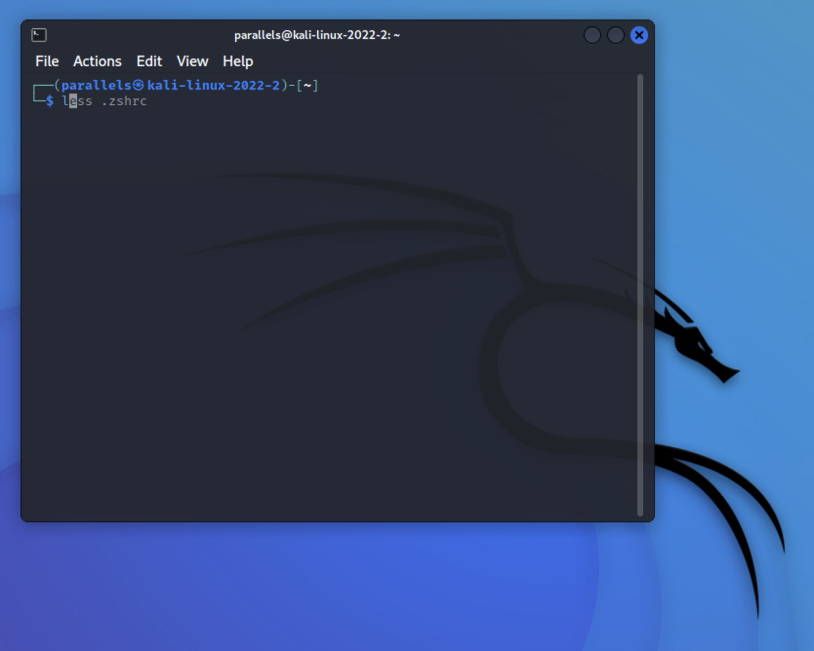

When I have opened Terminal on Kali Linux the first impression was that they have chosen to use `fish` as a default
shell. But after a simple `echo $SHELL` I realized that is very nicely customized `zsh`. A lot of developers have
switched to `fish` for various features that comes out of the box with this shell, but it feels like just recenly (probably
over 10 years ago), I have switched to `zsh`, and don't want to do another transition for a while.



If you did not know, Apple now configured `zsh` as a default shell for new users for the last several years, and before
that it used `bash`. Most Linux distros use `bash` as default shell, and `zsh` is very similar to `bash`, at least 99%
of the scripts you wrote for `bash` will work in `zsh` as well.

## `.zshrc` file

macOS provides a very naked `zsh` configuration. For the new user you will find, that file `~/.zshrc` does not even exist.
Kali Linux provides their `.zshrc` configuration at
[gitlab.com/kalilinux/packages/kali-defaults/-/blob/kali/master/etc/skel/.zshrc](https://gitlab.com/kalilinux/packages/kali-defaults/-/blob/kali/master/etc/skel/.zshrc).

Assuming your `~/.zshrc` is completely empty

```bash
curl -L -o ~/.zshrc 'https://gitlab.com/kalilinux/packages/kali-defaults/-/raw/kali/master/etc/skel/.zshrc?inline=false'
```

> You can 

With this simple change, you already going to see some changes in the terminal.

## brew packages

That `.zshrc` file has some dependencies that we need to install. I am using [brew](https://brew.sh) to install most of the CLI tools,
and highly recommend it to anyone on macOS.

You can fi
