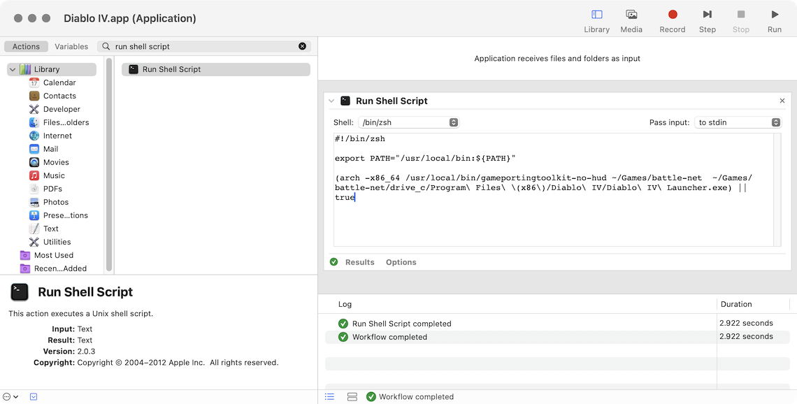
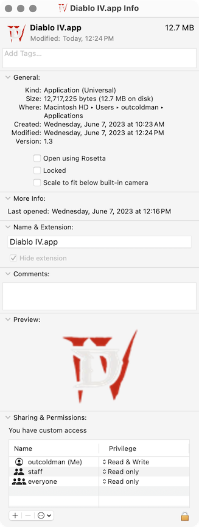

It is incredible. You can actually play AAA games on your Mac that require DirectX12. Diablo IV is one of them.
I am able to play Diablo IV on my maxed-out MacBook Pro 16" 2023 with M2 Max 96Gb of RAM. 

Don't want to get credit on that, as I have found an almost working for me solution on 
[r/macgaming](https://www.reddit.com/r/macgaming/comments/14307be/comment/jn7dxzo/?context=3).

## Prerequisites

I am running macOS 14 Developer Beta 1 (Sonoma), but some people mentioned that it might work on macOS Ventura as well (the latest release 13.4).
You need to have an Apple Silicon Mac, as it will not work on Intel-based Macs.

### Install Command Line Tools for Xcode 15 Beta

Download Command Line Tools from [https://developer.apple.com/download/all/](https://developer.apple.com/download/all/?q=xcode%20command%20line%20tools%2015).

After downloading and installing, verify that they are used by default. Open terminal and run:

```bash
xcode-select -p
```

It should print something like:

```text
/Applications/Xcode-beta.app/Contents/Developer
```

If you see `Xcode.app` instead of `Xcode-beta.app`, then run:

```bash
xcode-select -s /Applications/Xcode-beta.app/Contents/Developer
```

### Install Rosetta 2

Rosetta 2 is allowing you to run Intel-based apps on Apple Silicon. Considering that most of the games for Windows are
built for Intel (`x86-64` architecture), you will need to install Rosetta 2.

Open terminal and run:

```bash
softwareupdate --install-rosetta
```

## Install Game porting toolkit beta

Download it from [https://developer.apple.com/download/all](https://developer.apple.com/download/all/?q=game%20porting%20toolkit)
and run `Game_porting_toolkit_beta.dmg`. It will mount a volume in `"/Volumes/Game Porting Toolkit-1.0"`.

You can open `Read Me.rtf` file to read more about the Game porting toolkit and how to use it.

### Switch to Intel architecture in terminal

Open terminal and run:

```bash
arch -x86_64 zsh
```

That will run all the following commands under Rosetta 2 with Intel architecture.

### Install homebrew

Even if you already have homebrew installed on your macOS, it is probably installed for Apple Silicon. You need to install
it for Intel architecture.

Homebrew is an unofficial package manager that most of the developers use to install various tools for Development, 
Terminals, and not only. It is very respected in the community and has a lot of packages available.

To install it, you can look at the installation manual at [https://brew.sh](https://brew.sh), you need to run the following
command in the terminal (here, and later I already assume that you are running it under Rosetta 2, see the previous section):

```bash
/bin/bash -c "$(curl -fsSL https://raw.githubusercontent.com/Homebrew/install/HEAD/install.sh)"
```

If you already have `homebrew` installed for Apple Silicon, that version is located under `/opt/homebrew`. The version
for Intel will be installed under `/usr/local`. So they are not going to conflict with each other.

But you want to tell this terminal session to use `/usr/local` instead of `/opt/homebrew`. To do that, you need to modify
the `PATH` environment variable for this terminal session. You can do that by running:

```bash
export PATH="/usr/local/bin:${PATH}"
```

Make sure that when you run `which brew` it prints `/usr/local/bin/brew`.

You can also check that `homebrew` is installed for Intel correctly by running:

```bash
brew doctor
```

And see if there are any permission issues. For me, I had to run the following

```bash
sudo chown -R $(whoami) /usr/local/share/zsh /usr/local/share/zsh/site-functions
```

> If you already had `homebrew` installed for Intel, you might have to run `brew update` and `brew upgrade` to update.

### Install game-porting-toolkit

Tap (*brew terminology to add*) official packages provided by Apple for homebrew

```bash
brew tap apple/apple http://github.com/apple/homebrew-apple
```

And install them

```bash
brew -v install apple/apple/game-porting-toolkit
```

That command will run for a while (40 minutes on my MBP 16" 2023). It will install a lot of dependencies.

### Prepare Diablo IV

I decided to keep all the games in `~/Games`, so I have created a folder in my home director

```bash
mkdir ~/Games
```

After that I decided to keep all Battle.net games in one folder under `~/Games/battle-net`. 

Configure that for the current terminal session (command to tell Wine where the games are located):

> Wine is a tool to run Windows apps on macOS. It is used by Crossover and Game Porting Toolkit provided by Apple.

```bash
export WINEPREFIX=~/Games/battle-net
```

Prepare the folder for Diablo IV

```bash
`brew --prefix game-porting-toolkit`/bin/wine64 winecfg
```

A “Wine configuration” window should appear on your screen. Change the version of Windows to Windows 10. 
Choose Apply and then OK to exit winecfg.

Install Game Porting Toolkit library directory into Wine’s library directory

```text
ditto /Volumes/Game\ Porting\ Toolkit-1.0/lib/ `brew --prefix game-porting-toolkit`/lib/
```

And copy all the required executables to `/usr/local/bin`, so you can access them later without attaching Game Porting Toolkit volume.

```text
cp /Volumes/Game\ Porting\ Toolkit-1.0/gameportingtoolkit* /usr/local/bin
```

Update a Windows version in Wine registry to match expected build by Battle.net app

```bash
`brew --prefix game-porting-toolkit`/bin/wine64 reg add 'HKEY_LOCAL_MACHINE\Software\Microsoft\Windows NT\CurrentVersion' /v CurrentBuild /t REG_SZ /d 19042 /f
`brew --prefix game-porting-toolkit`/bin/wine64 reg add 'HKEY_LOCAL_MACHINE\Software\Microsoft\Windows NT\CurrentVersion' /v CurrentBuildNumber /t REG_SZ /d 19042 /f
`brew --prefix game-porting-toolkit`/bin/wineserver -k
```

### Install Battle.net app and Diablo IV for Windows

Download Battle.net app for Windows from [https://www.blizzard.com/download/](https://www.blizzard.com/download/confirmation?platform=windows&locale=en_US&product=bnetdesk).

Assuming you have it downloaded in your `~/Downloads` folder, verify that Wine already has it too:

```bash
ls ~/Games/battle-net/drive_c/users/crossover/Downloads/
```

You should see `Battle.net-Setup.exe` there.

Install Battle.net app for Windows

```bash
gameportingtoolkit ~/Games/battle-net ~/Games/battle-net/drive_c/users/crossover/Downloads/Battle.net-Setup.exe
```

You should see Battle.Net app window on your screen. Login with your Blizzard account and install Diablo IV.
After installing, you can launch the game.

By default, you will see a performance HUD, that shows you FPS, CPU, and GPU usage. You can use it to configure the game
Graphics settings to get the best performance. Later we can disable them.

## Diablo IV Grahic settings

I am playing on 6k external display. My resolution is set to 3072x1728 in game. To get the best performance, I have set
Quality Preset to Ultra, and changed FidelityFX Super Resolution to Quality. I see about 40-50 FPS in the game.


## Creating a shortcut to launch Diablo IV

You can always launch Diablo IV from the terminal by running

```bash
PATH="/usr/local/bin:${PATH}" arch -x86_64 /usr/local/bin/gameportingtoolkit-no-hud ~/Games/battle-net  ~/Games/battle-net/drive_c/Program\ Files\ \(x86\)/Diablo\ IV/Diablo\ IV\ Launcher.exe
```

Here I am using `gameportingtoolkit-no-hud` instead of `gameportingtoolkit` to disable the performance HUD.

But I found it nicer to create a shortcut to run the game without opening the terminal. To do that, you can open an Automator.app on your macOS and
create a new Application. Add a `Run Shell Script` action and paste the following code there:

```bash
#!/bin/zsh

export PATH="/usr/local/bin:${PATH}"

(arch -x86_64 /usr/local/bin/gameportingtoolkit-no-hud ~/Games/battle-net  ~/Games/battle-net/drive_c/Program\ Files\ \(x86\)/Diablo\ IV/Diablo\ IV\ Launcher.exe) || true
```



Save the application to `~/Applications/Diablo IV.app` (create the folder `~/Applications` if it doesn't exist).

Download a `Diablo IV` image for example from [Diablo IV Official Website](https://blz-contentstack-images.akamaized.net/v3/assets/blt72f16e066f85e164/blt15336eccf10cd269/diablo-IV.webp?width=96&format=webply&quality=95).

In Finder go to the folder where you save `Diablo IV.app`, select it and Open `Get Info` (⌘I). Drag and drop the image
to the top left corner of the window. It should replace the default icon.



Now you can launch Diablo IV from the Applications folder.

