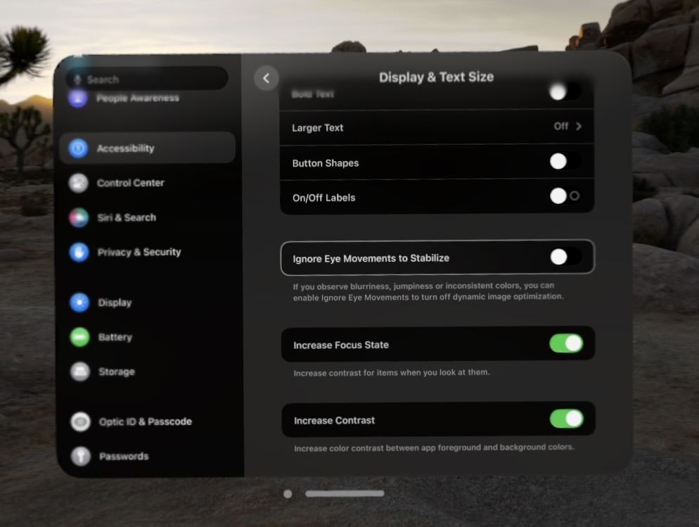
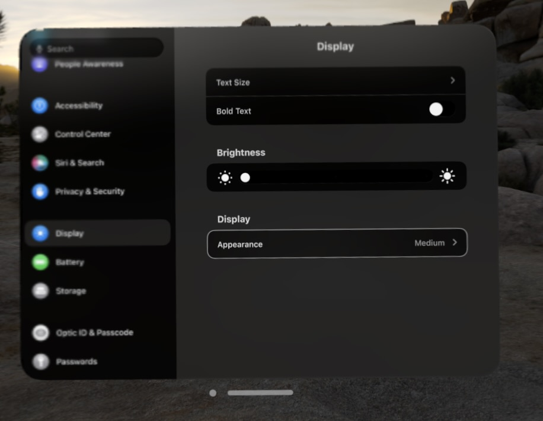
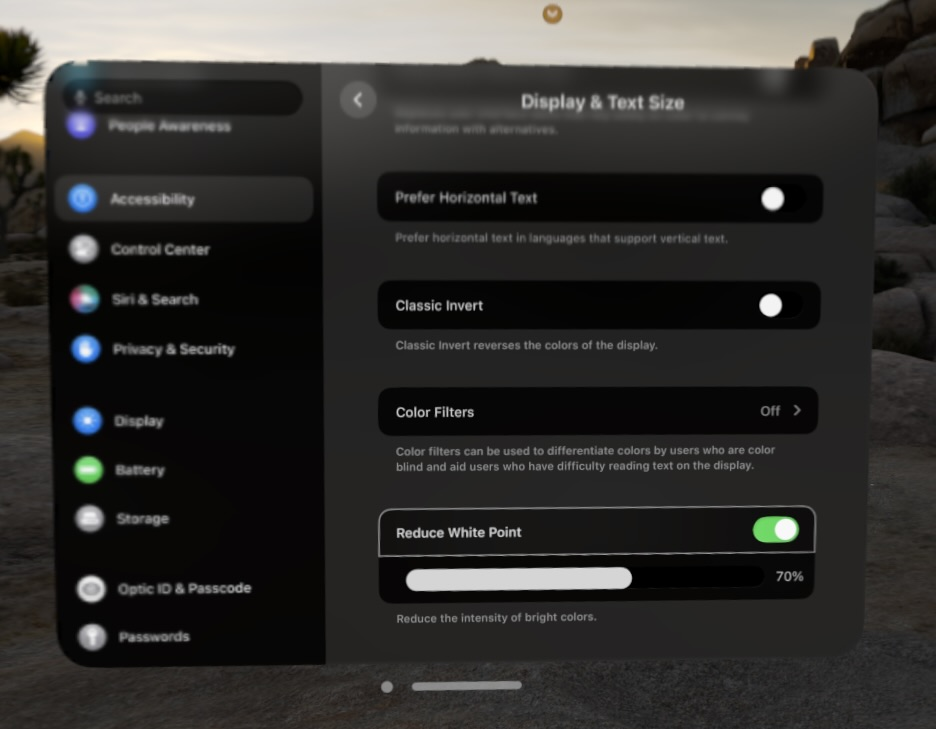

First 24 hours with Vision Pro. It feels like a generation 1 product. Similar to how I felt with Apple Watch or Macbook M1,
when they just came out. A lot of small issues here and there, but overall very impressed with the potential.

# Issue 1: Glare from very bright light on lens. 

Watching movies or playing games on Vision Pro is very straightforward. The screen does not have a lot of white lights, so
it does not reflect on the lens. However, the first time you try to open Apple Books or connect to your Mac, or open a website
with a lot of white backgrounds, you will notice a glare. It took me a while to recognize that this is a glare, and not
dirty lens. I have wiped the lens so many times, and it did not help.

There are a few ways to reduce this glare:

1. Enable Dark Mode on Vision Pro. It is not obvious how to do this. You need to go to the Settings, Accessibility, 
Display & Text Size, and enable Increase Contrast. That will make most windows to render in dark mode.

2. Reduce the brightness of the screen. Settings, Display. Change the brightness to the minimum.

3. And the most important. Reduce White Point. Settings, Accessibility, Display & Text Size, Reduce White Point. I have
set mine to 70%.
   

4. Settings up the environment helps as well. I have noticed that in TV app if you choose the Theater mode, it is just
too dark outside the screen, which makes the glare more noticeable. But something not that dark, like a Joshua tree, feels
way better. 

It will take some time to adjust to the new screen settings. Give it a try, and see if that will help you. 

## Issue 2: What am I looking at?

The second issue I have noticed is that you have to work with eye tracking. So many times you look what you want to click, 
pinch your fingers, while switching your eyes to something else, and accidentally select the wrong thing. 

1. First, you just need to train yourself to look at the right place, and don't change your attention until the action is done.

2. What helped me, another settings in Accessibility. Display & Text Size, and select Increase Focus State. That way,
the buttons/items you are looking at will be highlighted.

## Issue 3: Pointers, Keyboard, and a Mouse.

Typing on the virtual keyboard is not the best experience, and that was expected. You can definitely type a website address.
But you can connect a keyboard and trackpad to the Vision Pro. Not a mouse. That is a strange limitation. You can use
the trackpad, but not the mouse. 

## Issue 4: Vision Pro as an external display for a Mac.

1. After you will fix the glare, and if you like me, used to like a light mode, it is time to go back to dark. That is one
more step to fix annoying glare. 

2. Adding a little of environment helps as well. I keep it maybe on around 40%, so I can still see my hands and keyboard.
But nothing in background.

3. Anything small on the Vision Pro is hard to see. I feel like I make my monitor to be around 50 to 60 inches, compared 
to the 32-inches monitor that I have in front of me. It does take an adjustment to move your head a little bit more to see
the whole screen, but adjustment is pretty quick.

## Summary

Overall, I am very impressed with the Vision Pro. This is not my first VR device. I used Oculus Rift, and Oculus Quest 2,
and now I have Oculus Quest 3. I am still planning to use Quest 3, as I feel like it is way better device for fitness games, 
and not that expensive, so not that affraid to make it sweaty, or even drop it. But I am planning to enjoy Vision Pro
for productivity, games, and movies.

Hope this is not the last my post about Vision Pro. I am planning to write more about my experience with it. And really
hope to get some time to actually build something for it.

