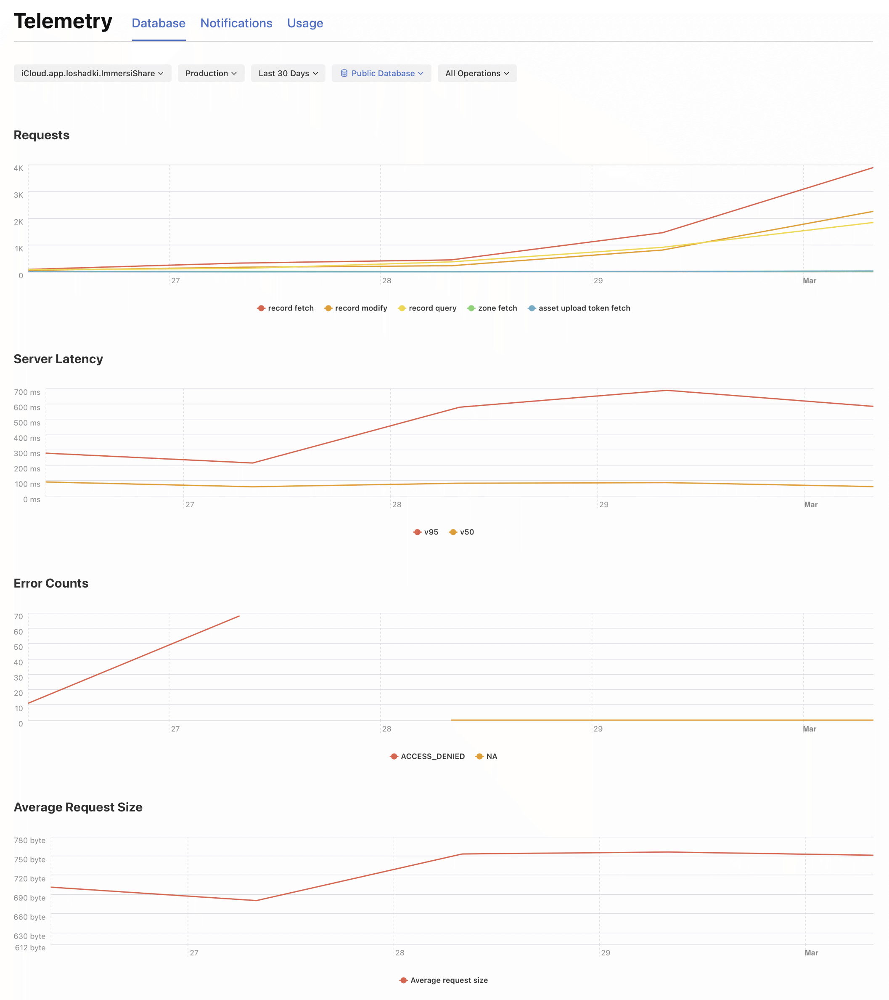

There are many discussions about the 30% fee Apple charges for the App Store. This fee is significant, and its benefits 
are not immediately clear. The complaints primarily come from large companies like Epic Games, Spotify, and Netflix, 
which have the resources to challenge Apple. However, what about indie developers? What do we receive in return for 
this 30% fee, and are we genuinely upset about it?

In practice, when I price my applications, I understand that charging $10 means I will receive $7. To obtain $10, I 
would need to set the price at $14. It's as straightforward as that.

As an indie developer, this isn't my sole income source. I also run a full-time B2B company, through which I've gained 
extensive business knowledge, including managing taxes worldwide and state taxes in the US. I'm relieved not to face 
these tax issues in my indie projects.

So. **Benefit 1: Taxes.** I'm spared from dealing with VAT and other taxes.

What other advantages are there? **CloudKit Public Database.** This feature is invaluable for indie developers, though 
it's unlikely to be used by social networks like Instagram or Twitter, whose main revenue comes from selling user data. 
The limitation is that it restricts your app to Apple users, which may not suit everyone. However, it's an excellent 
starting point.

I chose to develop an Instagram/YouTube-like app for Vision Pro, ImmersiShare  [[1](https://loshadki.app/immersishare/)], 
allowing users to share spatial videos. 
I opted for CloudKit Public Database, despite its vague description on Apple's website [[2](https://developer.apple.com/icloud/cloudkit/)], 
which mentions starting with 10GB 
of asset storage, potentially expanding to petabytes without detailing the growth rate. A previous version of the CloudKit 
page on the Web Archive [[3](https://web.archive.org/web/20200317033409/https://developer.apple.com/icloud/cloudkit/)] 
featured a calculator showing that 100 thousand users would grant 50TB of asset storage and 500GB 
of database storage, which is quite generous.

ImmersiShare was launched a few days ago, and I've already noticed user growth and a proportional increase in storage.


In just five days, the user count reached 350, while storage expanded to 80GB, and the database to 800GB. The allowed 
traffic exceeded expectations, yet no errors appeared on the telemetry dashboard, indicating Apple's leniency.

Let's consult ChatGPT on the costs of running this application on AWS or DigitalOcean.

```text
Given the variability in pricing due to potential changes, discounts, and specific configurations, 
I'll provide a comparison based on standard pricing as of my last update in 2023. Please check the 
current pricing on AWS and DigitalOcean's official websites for the most accurate and up-to-date 
information.

AWS Pricing Overview (as of 2023)

- S3 Storage: $0.023 per GB for the first 50 TB / month (Standard Storage).
- RDS Database: Assuming a db.t3.micro instance for a generic database in the US East (N. Virginia) region, 
  the cost is approximately $0.017 per hour.
- Data Transfer: 100 GB/day = 3,000 GB/month. The first 1 GB is free, and up to 10 TB/month is $0.09 per GB.

DigitalOcean Pricing Overview (as of 2023)

- Spaces: $5 per month includes 250 GB of storage and 1 TB of outbound transfer. Additional storage is 
  $0.02 per GB, and additional transfer is $0.01 per GB.
- Managed Databases: Starting at $15 per month for the smallest node (1vCPU, 1GB RAM, 10GB SSD storage).
- Outbound Data Transfer: Included in Spaces pricing above; overage is $0.01 per GB.

Cost Comparison Table

| Service Component        |                     AWS Cost |                           DigitalOcean Cost |
|--------------------------|------------------------------|---------------------------------------------|
| Storage (80GB)           |                        $1.84 |                                      $5.60* |
| Database                 |                      ~$12.24 |                               (30 days) $15 |
| Data Transfer (100GB/day)| ~$270 (3,000 GB - 1 GB free) | Included in Spaces;                         |
|                          |                              |  overage would be $0 for the first 1TB,     |
|                          |                              |  then $20 for the additional 2TB            |
|--------------------------|------------------------------|---------------------------------------------|
| Total Monthly Cost       |                      ~284.08 |                                     ~ 40.60 |

*DigitalOcean Spaces pricing includes 250GB of storage and 1TB of outbound transfer. 
The cost for 80GB of storage is part of the base package, but the total cost considers potential 
overage for simplicity.

Notes:

- AWS might offer savings plans or reserved instances for databases that could lower the cost 
  significantly if you commit to a certain usage level.
- DigitalOcean's simplicity in pricing makes it easier to predict costs, especially for 
  straightforward use cases.
- Actual costs could vary based on specific configurations, regions, and changes in pricing after 2023.

Always refer to the providers' official documentation for the most current pricing and to calculate 
costs based on your specific requirements.
```

Let me clarify that **ImmersiShare is a free application**, and I have no intention of charging for it. My goal is to 
enhance the experience for Vision Pro users and myself, particularly given the current scarcity of apps for Vision Pro. 
Generating revenue from this app is not my objective.

I've noted that Apple currently promises a limit of 16GB for asset downloads per day, yet, based on the telemetry dashboard, 
users seem to be downloading nearly 80GB without any issues. This observation comes without encountering any request errors, 
aside from an initial hiccup during the TestFlight phase due to a minor database access error, which has since been resolved.



Throughout my career as an indie developer within the Apple ecosystem, I've earned approximately $15,000 after Apple's 
deductions. This implies that Apple has taken around $2,250 from me, considering I qualify for the Small Business Program, 
which only imposes a 15% fee. Therefore, those $2,250 have been allocated towards handling taxes and have afforded 
me **Benefit 2: iCloud Storage**.

To conclude, as an indie developer within the Apple ecosystem, I am not troubled by the 15–30% fee. I am content to pay it. 
There are aspects of the App Store that I find dissatisfying, but the fee is not among them.

---

- [1] https://loshadki.app/immersishare/
- [2] https://developer.apple.com/icloud/cloudkit/
- [3] https://web.archive.org/web/20200317033409/https://developer.apple.com/icloud/cloudkit/